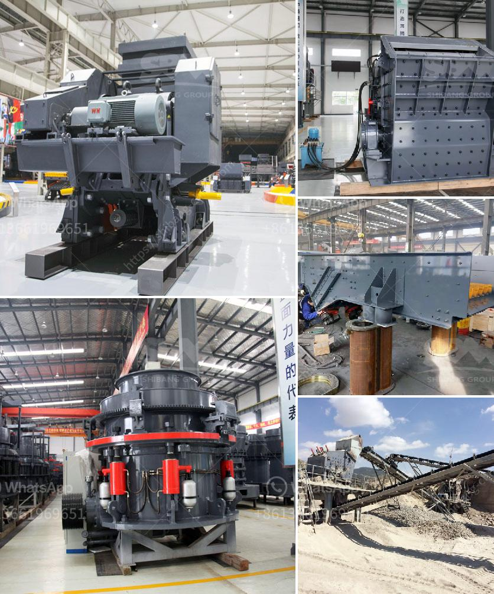

<h3>stone mill grinder price</h3>
In recent years, the use of stone mill grinders has seen a rise in popularity among both professional chefs and home cooks. These grinders offer a unique approach to grinding a variety of ingredients, providing a superior texture and flavor to your culinary creations. However, with the growing market demand, understanding the right stone mill grinder price can be overwhelming. This article aims to delve into the factors affecting the price range and the reasons why investing in a stone mill grinder is a wise decision for your kitchen.

When it comes to stone mill grinders, there are a few key factors that determine the price range. One such factor is the size of the grinder. Stone mill grinders are available in various sizes, ranging from compact tabletop models to heavy-duty industrial ones. Naturally, larger models with higher capacities tend to be pricier due to their advanced features and higher production capabilities. Therefore, the amount of grinding you typically engage in should be a crucial consideration when determining the appropriate size and price for your needs.

Another significant factor affecting the stone mill grinder price is the quality of the materials used. High-quality stone mill grinders are typically made of durable materials, such as granite or marble. The use of these materials ensures longevity and enhances the grinding process by preserving the natural flavors and aromas of the ingredients. Consequently, stone mill grinders made from premium materials will have a higher price tag but will also deliver superior performance and longevity.

The type of motor also affects the price range of stone mill grinders. While some models feature traditional motors, others come equipped with more advanced mechanisms such as low-temperature mills or noiseless motors. These features offer added convenience and functionality, thereby warranting a higher stone mill grinder price. Consider your usage preferences and the importance of these additional features before making a purchasing decision.

Investing in a stone mill grinder is a wise decision for several reasons. Firstly, these grinders provide an unrivaled flavor and texture by gently grinding the ingredients through a natural process. The resulting ground ingredients retain optimal nutrition levels while releasing their full aromatic potential. These qualities cannot be replicated by conventional grinders, making a stone mill grinder an indispensable tool for passionate cooks and professionals alike.

Secondly, stone mill grinders are incredibly versatile, allowing you to grind various ingredients effortlessly. From grains, legumes, and spices to nuts and seeds, a stone mill grinder can handle it all. This versatility eliminates the need for multiple grinding appliances, saving both space and money in your kitchen.

Lastly, stone mill grinders are built to last, ensuring long-term value for your investment. The durability and high-quality construction of these grinders mean that they can withstand heavy and continuous use without compromising performance. By purchasing a stone mill grinder, you are making a sound investment that will serve you well for years to come.

In conclusion, determining the right stone mill grinder price requires careful consideration of factors such as size, material quality, and additional features. While prices can vary depending on these aspects, investing in a stone mill grinder is a wise decision for your kitchen. The superior flavor and texture it brings to your culinary creations, along with its versatility and durability, make it an invaluable tool for any cooking enthusiast or professional chef. So, don't hesitate to enhance your culinary journey by adding a stone mill grinder to your kitchen arsenal today.
<h3>Contact us</h3><ul><li><strong>Whatsapp:&nbsp;<a href="https://wa.me/8613661969651">+8613661969651</a></strong></li><li><a href="https://swt.shibang-china.com/?git&amp;zhl&amp;stone mill grinder price"><strong>Online Service(chat now)</strong></a></li></ul><h3>Related</h3><ul><li><a href='gravel cone crusher for sale.md'>gravel cone crusher for sale</a></li><li><a href='product of crushing plant.md'>product of crushing plant</a></li><li><a href='how much can a quarry plant cost.md'>how much can a quarry plant cost</a></li><li><a href='flow chart for gold extraction from ores.md'>flow chart for gold extraction from ores</a></li><li><a href='dry grinders mills.md'>dry grinders mills</a></li></ul>