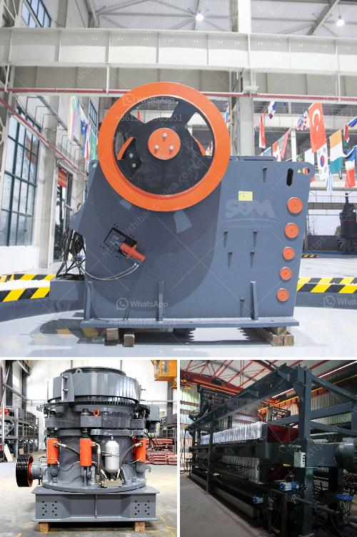

<h3>stone quarry crusher project report pdf</h3>
Stone quarry crusher project report pdf is a leading global manufacturer of crushing and milling equipment (stone quarry crusher project report pdf), also supply individual (stone quarry crusher project report pdf.) crushers and mills as well as spare parts of them. offer advanced, rational solutions for any size-reduction requirements, including quarry, aggregate, grinding production and complete plant plan. stone quarry crusher project report pdf...

Stone quarry crusher project report pdf is a leading global manufacturer of crushing and milling equipment (stone quarry crusher project report pdf), also supply individual (stone quarry crusher project report pdf...) crushers and mills as well as spare parts of them. offer advanced, rational solutions for any size-reduction requirements, including quarry, aggregate, grinding production and complete plant plan.

Stone quarry crusher project report pdf has been designed to help clients meet the challenges posed by financial markets today. Increasingly capital intensive projects, it has become imperative to have a sound project planning and execution capability to ensure timely and cost effective completion of projects. Today, it is no longer adequate to build a new facility or renovate an existing one in isolation from the rest of the organization. The stone quarry crusher project report provides a comprehensive overview of the global market size, scope, trends, growth opportunities, and key players in the industry. The report also includes an in-depth analysis of the current market dynamics, such as drivers, restraints, and opportunities. Furthermore, the report encompasses the manufacturing process, cost structure, and marketing strategies of the leading players. The stone quarry crusher project report emphasizes the importance of collaboration among different stakeholders, including government agencies, private sector organizations, and local communities in fostering the sustainable growth of the industry. In addition, the report provides recommendations and guidelines to assist stakeholders in formulating strategies to overcome the challenges and maximize the opportunities in the market. The stone quarry crusher project report also evaluates the current technology trends and developments in the industry. Investment feasibility analysis, investment return analysis, and SWOT analysis have been used to identify the key market drivers and challenges. The stone quarry crusher project report is a valuable source of insightful data for business strategists. It provides the industry overview with growth analysis and historical & futuristic cost, revenue, demand, and supply data (as applicable). The research analysts provide an elaborate description of the value chain and its distributor analysis. This stone quarry crusher project report examines the international and national markets in detail, emphasizing on the leading segments such as market size, manufacturing cost structure, economic impact of stone quarry crusher project, competitive landscape and innovative strategies followed by key players. The report also provides information about the current market scenario, industry trends, and market forecast for the period from 2021 to 2026.
<h3>Contact us</h3><ul><li><strong>Whatsapp:&nbsp;<a href="https://wa.me/8613661969651">+8613661969651</a></strong></li><li><a href="https://swt.shibang-china.com/?git&amp;zhl&amp;stone quarry crusher project report pdf"><strong>Online Service(chat now)</strong></a></li></ul><h3>Related</h3><ul><li><a href='jaw crushers south africa.md'>jaw crushers south africa</a></li><li><a href='stamp mills for sale in zimbabwe.md'>stamp mills for sale in zimbabwe</a></li><li><a href='gypsum mining companies in kenya.md'>gypsum mining companies in kenya</a></li><li><a href='stone crusher machine supplier.md'>stone crusher machine supplier</a></li><li><a href='crushing plant aggregates in south africa.md'>crushing plant aggregates in south africa</a></li></ul>