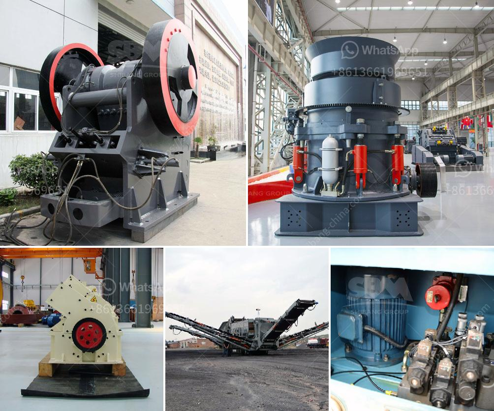

<h3>stone quarry machine manufacturers</h3>
Stone quarrying is a complex operation requiring different types of machinery. With the ever-increasing demand for limestone, marble and other natural stones, the need for skilled stone quarry machine manufacturers is crucial. Whether it is a small or large quarry, the quarrying process remains the same, as does the associated machinery.

To serve the growing demand, manufacturers aim to deliver the best stone quarry machines during intricate stone-cutting processes. They understand that every quarry is unique, requiring specific equipment to produce the desired aggregates and minerals.

One of the primary factors in the success of any stone quarrying operation is the ability to process and move materials efficiently. Accordingly, reputable manufacturers focus on delivering machines that maximize productivity and minimize downtime. These machines include various types of crushers, screens, feeders, and conveyor systems to handle and process the quarry's output.

Moreover, stone quarry machine manufacturers are constantly evolving their product line to meet the challenges posed by the industry. They invest in research and development to incorporate the latest technological advancements in their machinery. The goal is to enhance efficiency, reduce energy consumption, and minimize the environmental impact of quarrying operations.

In addition to the machinery itself, manufacturers also offer comprehensive after-sales service and support to their customers. This ensures that the equipment is properly maintained, repaired, and optimized throughout its lifecycle. Regular maintenance and timely troubleshooting help to prolong the life of the equipment, preventing unexpected breakdowns and reducing operational costs.

For quarry owners, partnering with reliable stone quarry machine manufacturers is a win-win situation. It enables them to procure high-quality machinery that streamlines their operations, improves productivity, and ultimately boosts profitability. Simultaneously, such collaborations support the growth and sustainability of the quarrying industry as a whole.

In conclusion, stone quarry machine manufacturers play a vital role in the growth and success of the quarrying industry. Their innovative machinery, combined with excellent service and support, helps quarry owners meet the increasing demand for natural stones. By choosing the right manufacturer, quarry operators can enhance their operational efficiency, reduce downtime, and contribute to sustainable quarrying practices.
<h3>Contact us</h3><ul><li><strong>Whatsapp:&nbsp;<a href="https://wa.me/8613661969651">+8613661969651</a></strong></li><li><a href="https://swt.shibang-china.com/?git&amp;zhl&amp;stone quarry machine manufacturers"><strong>Online Service(chat now)</strong></a></li></ul><h3>Related</h3><ul><li><a href='stone crusher manufacture.md'>stone crusher manufacture</a></li><li><a href='companies manufacturing quarry plant in uk.md'>companies manufacturing quarry plant in uk</a></li><li><a href='gravel making crusher.md'>gravel making crusher</a></li><li><a href='crushing and screening process.md'>crushing and screening process</a></li><li><a href='proposal for stone crushing business in kenya.md'>proposal for stone crushing business in kenya</a></li></ul>