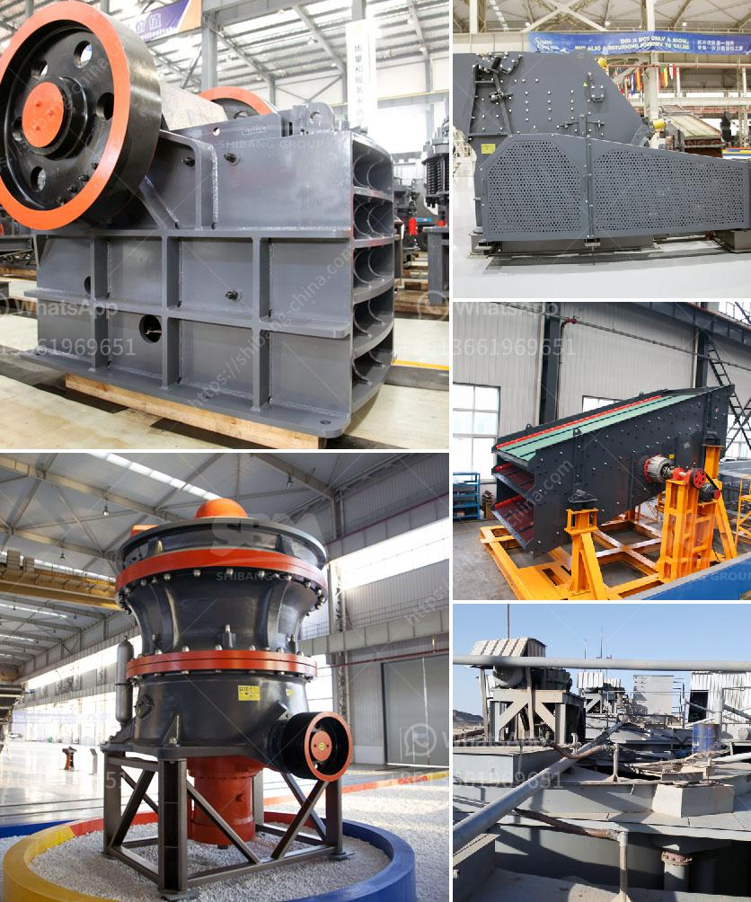

<h3>stones crushing machine in south africa for sale</h3>
Stone crushing machine is fundamental equipment for the stone crushing production line. With the advancement of production technology in South Africa, mobile crushing plant, stone crushing machines for sale in South Africa have become more and more prevalent. It is often used as a primary crusher in a multistage crushing process or as a stand-alone crushing plant. Whether it is a tire-type movable crushing station or a crawler-type crushing station, the stone crushing production line in South Africa has always been one of the hot topics that mining machinery manufacturers are discussing.

Stone crushing machine in South Africa is mainly used for crushing stones, mine ores into small pieces for building aggregate crushing, silica sand mining, and mine ore mining, processing plant. In South Africa, the mining process of crushing needs to use the equipment such as crushers. Among these types of crushing equipment, jaw crusher machines are the most widely used in South Africa.

Jaw crusher is mainly used as primary crusher, its crushing ratio is 4-6. Large production capacity, uniforme product size, low operation cost, simple structure, reliable work, easy maintenance, and low maintenance cost are its mature advantages. Jaw crusher machines have widely applications in many industries, such as mining industry, construction industry, metallurgy industry, chemical industry, and water conservancy industry and so on. The jaw crusher machines are driven by motors. Through the motor’s wheels, the eccentric shaft is driven by the triangle belt to make the moving jaw plate move by a regulated track. Therefore, the materials in the crushing cavity composed of fixed jaw plate, movable jaw plate and side-lee board can be crushed and discharged through the discharging opening.

Apart from jaw crusher machine, there are also many other stone crushers machine for sale in South Africa, such as: cone crusher, impact crusher, hammer crusher, roller crusher, mobile crushing plant, etc. These crushers from the processing of design and operation can be more affordable, but also to ensure that the equipment is durable and efficient, and excellent performance. For example, due to cone crusher compact structure, stable working condition, easy operation and high crushing ratio, it is indeed a type of crushing equipment with optimum performance. The cone crusher is widely used in construction projects, attests to its unrivaled reliability and adaptability. It is the most widely used crushing equipment in the processing of stone materials.

To sum up, the stone crusher machine has been used in South Africa mining industry for many years, and its technology is mature, reliable and stable. It has been widely used in the application of medium and fine crushing of various ores and bulk materials in building materials, mining, metallurgy, chemical industry and other industries. Therefore, the stone crusher machine is loved and sought after by customers. The machine's performance is stable and the granularity of the finished products is even and adjustable, which is appreciated by customers. Whether it is in the mining process or various construction industries, the stone crusher machine can be used as a high-quality and cost-effective crusher machine. Therefore, in South Africa, the professional stone crusher machine is widely used in the construction waste recycling, mining industry and mineral processing plant.
<h3>Contact us</h3><ul><li><strong>Whatsapp:&nbsp;<a href="https://wa.me/8613661969651">+8613661969651</a></strong></li><li><a href="https://swt.shibang-china.com/?git&amp;zhl&amp;stones crushing machine in south africa for sale"><strong>Online Service(chat now)</strong></a></li></ul><h3>Related</h3><ul><li><a href='mobile concrete crusher uk prices.md'>mobile concrete crusher uk prices</a></li><li><a href='mobile crushers for sale ghana.md'>mobile crushers for sale ghana</a></li><li><a href='used mobile jaw crusher sale.md'>used mobile jaw crusher sale</a></li><li><a href='price ball mill 40tph.md'>price ball mill 40tph</a></li><li><a href='german zenith made mobile stone crusher.md'>german zenith made mobile stone crusher</a></li></ul>