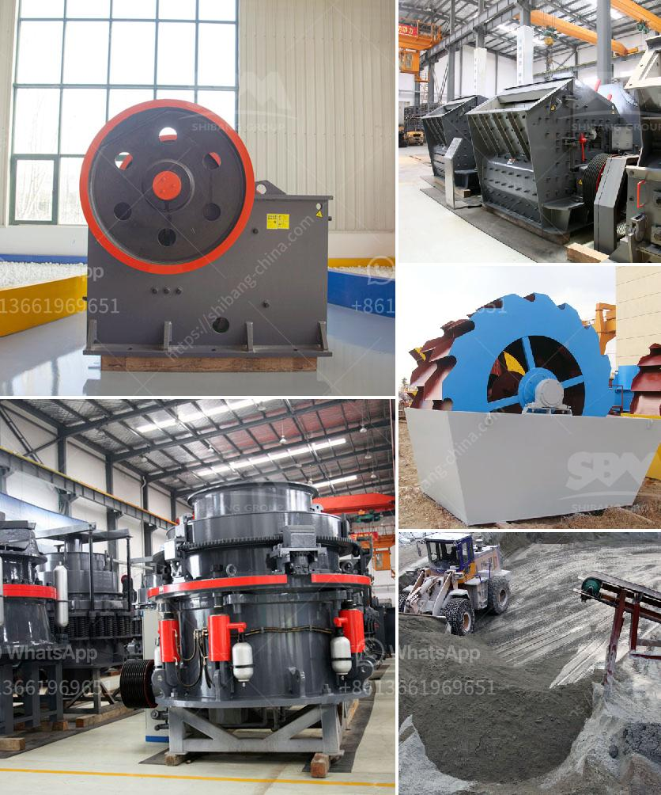

<h3>suppliers of chromite sand from south africa</h3>
Chromite sand, a natural resource widely used in various industries, holds significant importance for its high thermal resistance and anti-corrosive properties. South Africa, as one of the largest producers of chromite globally, offers a prominent source for this mineral. In this article, we will identify and investigate some of the leading suppliers of chromite sand hailing from South Africa.

Established in 1992, Rand York Minerals is a leading supplier of chromite sand, serving both domestic and international markets. With its headquarters in Johannesburg, the company operates a modern processing facility capable of delivering high-quality chromite sand products. Rand York Minerals has gained a reputation for consistently meeting customer specifications and maintaining prompt delivery schedules.

The company sources its chromite sand as raw material from various mines located across South Africa. The sand is then washed, dried, and screened to meet specific customer requirements. Rand York Minerals ensures the products undergo strict quality control measures, including testing for chemical composition, particle size distribution, and sintering characteristics.

As an ISO 9001-certified company, Rand York Minerals abides by stringent quality management practices, ensuring customer satisfaction. Their products find applications in diverse industries, including foundry, molding, and refractory manufacturing.

ChromTech Holdings is a leading integrated chrome producer, supplying chromite sand, ferrochrome, and other chromite-based products. Situated in the Rustenburg area, ChromTech operates two chromite sand mines in close proximity to their processing facility. This strategic location allows for efficient mining, processing, and distribution of high-quality chromite sand.

ChromTech prides itself on its advanced mining techniques, employing sustainable practices to optimize resource utilization. The company's processing plant utilizes innovative beneficiation methods to maximize the chromite content in their sand products. Stringent quality controls ensure that customers receive sand with precise chemical composition, particle size distribution, and thermal behavior.

ChromTech's chromite sand is in high demand by foundries, refractory manufacturers, and other high-temperature industries due to its exceptional heat resistance and anti-corrosive properties. The company's commitment to sustainable mining practices has earned them recognition for environmental stewardship in the industry.

South Africa, being a significant producer of chromite globally, offers several reputable suppliers of chromite sand. Companies such as Rand York Minerals and ChromTech Holdings excel in sourcing, processing, and distributing high-quality chromite sand, meeting diverse customer specifications. Their commitment to quality, sustainability, and customer satisfaction solidifies their positions as leading suppliers in the market.
<h3>Contact us</h3><ul><li><strong>Whatsapp:&nbsp;<a href="https://wa.me/8613661969651">+8613661969651</a></strong></li><li><a href="https://swt.shibang-china.com/?git&amp;zhl&amp;suppliers of chromite sand from south africa"><strong>Online Service(chat now)</strong></a></li></ul><h3>Related</h3><ul><li><a href='nigeria quartz plant in kenya.md'>nigeria quartz plant in kenya</a></li><li><a href='gold ore processing nigeria.md'>gold ore processing nigeria</a></li><li><a href='eco stone crusher.md'>eco stone crusher</a></li><li><a href='puzzolana crusher tonnes per hour.md'>puzzolana crusher tonnes per hour</a></li><li><a href='raymond mills mexico.md'>raymond mills mexico</a></li></ul>