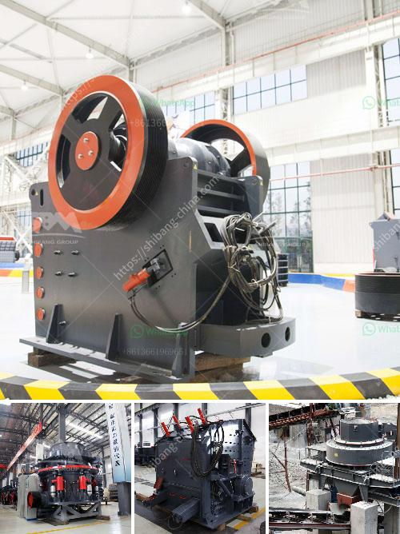

<h3>talc mining crusher costs</h3>
Talc, a soft and naturally occurring mineral, is widely used in various industries due to its unique properties. One of the most significant applications of talc is in the production of cosmetic products, such as baby powder and face powders. The process of obtaining talc from its mined ore is essential to meet the growing demand for this mineral. However, talc mining crusher costs can add up and become a significant factor when considering the profitability of talc mining operations.

The first step in the talc mining process is the removal of overburden from the deposit, which is often done using large hydraulic shovels. Once the overburden is removed, the talc ore is then extracted by drilling and blasting. These operations require heavy machinery and specialized equipment, which can incur substantial costs.

After the ore is extracted, it needs to be crushed into smaller pieces to make it easier to transport and process further. This is where talc mining crushers play a crucial role. Talc mining crushers are designed to break down the large chunks of ore into smaller, more manageable sizes. Crushers can be stationary or portable, depending on the mining operation's requirements.

The costs associated with talc mining crushers can vary greatly depending on factors such as the type of crusher, the capacity, and the location of the mining operation. Portable crushers, for example, may be more expensive upfront but can save on transportation costs in the long run. On the other hand, stationary crushers may have a lower initial cost but may require expensive infrastructure and maintenance over time.

In addition to the cost of the crusher itself, other expenses need to be considered. These include the cost of power, fuel, and labor. Crushers require a significant amount of energy to operate, and fuel costs can be substantial, especially for large-scale mining operations. Labor costs also need to be taken into account, as crushers require skilled operators to ensure their efficient and safe operation.

Moreover, the maintenance and repair costs associated with talc mining crushers can add up over time. As crushers are subjected to constant wear and tear, components may need to be replaced frequently. The cost of spare parts and the labor required for maintenance and repairs can impact the overall crusher cost.

It is important for mining companies to carefully evaluate the costs associated with talc mining crushers and consider them in the financial planning and decision-making process. Technology advancements have led to the development of more efficient and cost-effective crushers that can help optimize the overall mining process. Therefore, it is crucial to consider the long-term benefits and cost savings that these advancements can provide.

In conclusion, talc mining crushers play a crucial role in the ore extraction process. However, they can also contribute to significant costs for mining companies. It is important for these companies to evaluate the various factors impacting crusher costs and consider the long-term benefits of investing in efficient and cost-effective crushers. By doing so, mining companies can optimize their operations and ensure their profitability in the competitive talc market.
<h3>Contact us</h3><ul><li><strong>Whatsapp:&nbsp;<a href="https://wa.me/8613661969651">+8613661969651</a></strong></li><li><a href="https://swt.shibang-china.com/?git&amp;zhl&amp;talc mining crusher costs"><strong>Online Service(chat now)</strong></a></li></ul><h3>Related</h3><ul><li><a href='mobile jaw crusher tons per hour.md'>mobile jaw crusher tons per hour</a></li><li><a href='crushing and screening process.md'>crushing and screening process</a></li><li><a href='limestone processing plant philippines.md'>limestone processing plant philippines</a></li><li><a href='grinder mill powder singapore.md'>grinder mill powder singapore</a></li><li><a href='roller mill manufacturers in nigeria.md'>roller mill manufacturers in nigeria</a></li></ul>