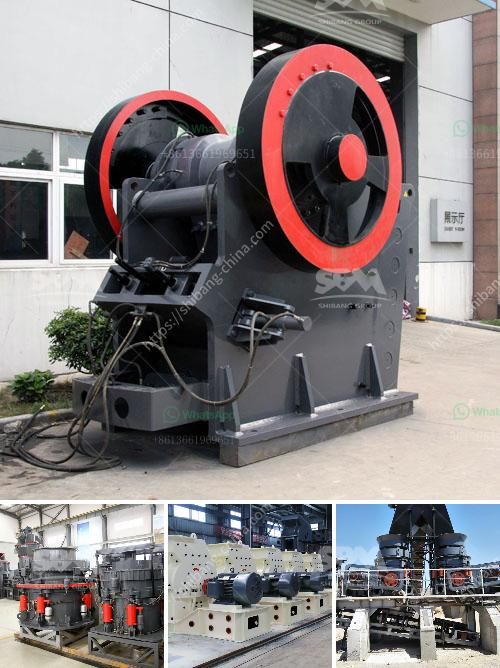

<h3>talc powder mill suppliers in china</h3>
Talc powder is a versatile mineral used in various industries, including cosmetics, ceramics, paint, plastics, and medical applications. With its softness and ability to absorb moisture, talc powder is in high demand globally. As a result, several countries are emerging as major suppliers of talc powder, with China leading the way.

China has become a key player in the global talc powder market due to its abundant reserves and advanced mining techniques. Chinese talc powder mill suppliers provide advanced equipment to improve the efficiency of crushing and milling. Advanced grinding equipment includes Raymond mills, high-pressure micro-powder mills, and ultra-fine powder mills. With the continuous development of grinding technology, there are more different types of mills available for various applications.

To process talc powder, these mills produce grinding efficiency and low energy consumption. Fineness control is essential during the grinding process to achieve the desired quality of the product. Manufacturers offer a wide range of grinding mills such as Raymond mill, vertical mill, ultrafine mill, and superfine mill.

Talc powder mill is integral equipment for talc production. Talc Crushing and Grinding. The ore is crushed, typically in a jaw crusher, and screened. The oversized coarse material is returned to the crusher, and the crushed material is  transported to the grinding mill for further grinding.

Talc powder mill is widely used in papermaking, plastics, rubber, coatings, paints, adhesives, sealants, and other products. Powder mill classification by mill.

In the talc industry, ceramic grade talc powder mill requirements are higher than the general-purpose powder mill, such as building materials, paper manufacturers, coatings, rubber, etc., preferably three-ring medium-speed micro-grinding, because talc powder good quality, high production efficiency.

China talc powder mill wins a good reputation worldwide thanks to its superior performance, efficient production, and competitive prices. Its high production efficiency and excellent quality have made it a globally recognized talc powder supplier. As the demand for talc powder continues to increase, China's talc powder mill suppliers will continue to occupy a significant portion of the market share. With their strong production capabilities and advanced technology, the prospects for China's talc powder industry are promising.

In conclusion, China's talc powder mill suppliers offer a wide range of products with high quality and performance. The global talc industry is growing rapidly, creating a huge demand for talc powder production. With China's strong capabilities in talc powder manufacturing, many international companies are turning to China for their talc supply needs. As the world's leading talc powder supplier, China's manufacturers are expected to continue dominating the global market.
<h3>Contact us</h3><ul><li><strong>Whatsapp:&nbsp;<a href="https://wa.me/8613661969651">+8613661969651</a></strong></li><li><a href="https://swt.shibang-china.com/?git&amp;zhl&amp;talc powder mill suppliers in china"><strong>Online Service(chat now)</strong></a></li></ul><h3>Related</h3><ul><li><a href='by products of copper processing.md'>by products of copper processing</a></li><li><a href='gypsum board production line for sale.md'>gypsum board production line for sale</a></li><li><a href='limestone grinding mill german for sale.md'>limestone grinding mill german for sale</a></li><li><a href='stone crusher in goa.md'>stone crusher in goa</a></li><li><a href='vibrating screen prices.md'>vibrating screen prices</a></li></ul>