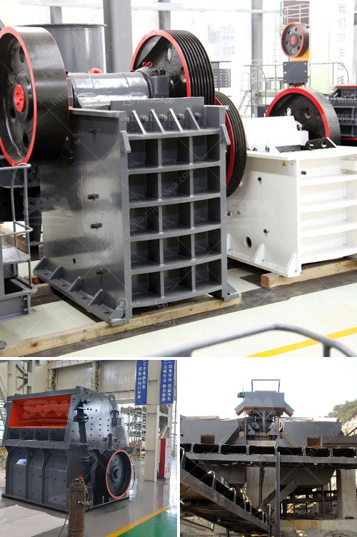

<h3>tanzania small stone crusher sale</h3>
Stone crushers are essential crushing equipment in mining and stone quarry site. In stone quarry, stone crushers are used to crush stones into small particle size or change the form such as basalt, granite, limestone, quartz, marble, for building aggregates, artificial sand production and recycle building waste materials such as debris, asphaltic cement concrete. Usually, stone crushers are consists of cone crusher, jaw crusher, impact crusher, vibrating screen, vibrating feeder, belt conveyor and dust catcher. Today, we have witnessed the rising of Tanzanian economy, which has promoted the sales of mining equipment and made Tanzania stone crusher equipment export.

The XSM Shanghai is a professional stone crusher, mill, mine equipment production line of professional equipment manufacturers in China, if you have any need online please click on the right icon logo, our technical staff will be based on your mining resourcesmining equipment to provide you with the most suitable for you. We have production capacity of more than 500 crushers and other mining machinery equipment, to provide customers with high-quality crushing equipment.

Tanzania is a country with rich mineral resources. Tanzania is an East African country with land area of 941,357 square kilometers (364,962 square miles), which is located in the eastern Africa, a strategically important place. Tanzania is mostly known for its vast wilderness areas, including the plains of Serengeti National Park, a safari mecca populated by the "big five" game (elephant, lion, leopard, buffalo, rhino), and Kilimanjaro National Park, home to Africa’s highest mountain. With the rapid development of Tanzania, small stone crusher sale has been in an important position.

There are rich mineral resources in Tanzania, such as diamond, gold, phosphate, gas and so on. Among these minerals, only gold ore has been exploited. In order to promote the development of mining industry in Tanzania and keep good relations with Tanzanian government, XSM has been closely development cooperation with the Tanzania industries department, which located in Dodoma capital. The XSM Shanghai has committed itself to the construction of mining machinery equipment, referred to the production capacity of more than 500 crushers and equipment, with customers around the world to establish a good relationship with customers, dedicated to the development and construction of Tanzania's mining industry.

Jaw crusher is mainly used for coarse crushing and medium crushing in the departments of mining, building materials and infrastructure construction. According to the feeding width, it can be divided into large, medium and small sized. The jaw crushers have many advantages such as simple structure, easy manufacturing, reliable working condition and convenient operation and maintenance.

Impact crusher is a new type of high-efficiency crushing equipment, which is characterized by small size, simple structure, large crushing ratio, low energy consumption, large capacity, uniform particle size and selective crushing effect. It is a promising equipment.

Cone crusher is a kind of crushing machine commonly used in mining, metallurgical industry, construction, road construction and chemical industry. Cone crusher can be used to crush hard and medium hard minerals, rocks, iron ores, limestone, copper ores, quartz, granite and sandstones, etc.

In conclusion, stone crusher is essential equipment in mining industry. The above equipment is our classic crusher equipment, and XSM always adheres to continuous innovation, never stops research and development of new products which meet market needs, and constantly develops new products to promote the development of Tanzanian small stone crusher sale industry.
<h3>Contact us</h3><ul><li><strong>Whatsapp:&nbsp;<a href="https://wa.me/8613661969651">+8613661969651</a></strong></li><li><a href="https://swt.shibang-china.com/?git&amp;zhl&amp;tanzania small stone crusher sale"><strong>Online Service(chat now)</strong></a></li></ul><h3>Related</h3><ul><li><a href='marble grinding factory in dubai.md'>marble grinding factory in dubai</a></li><li><a href='sand screening machines in south africa.md'>sand screening machines in south africa</a></li><li><a href='roller screen for coal.md'>roller screen for coal</a></li><li><a href='conveyor belts in malaysia.md'>conveyor belts in malaysia</a></li><li><a href='barite production lines manufacturers.md'>barite production lines manufacturers</a></li></ul>