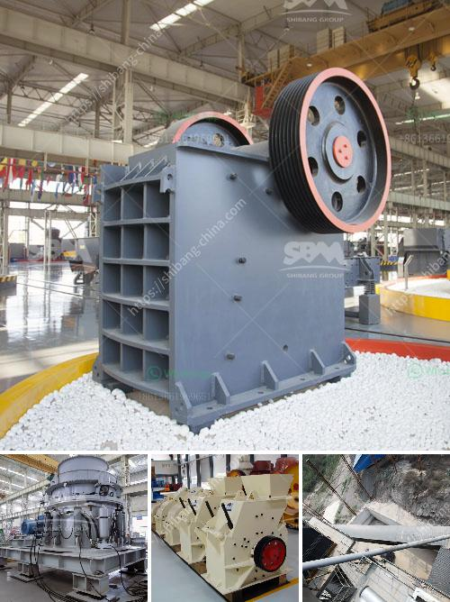

<h3>technical features of stone crusher</h3>
A stone crusher is a machine used to convert large stones into smaller sizes that can be used in construction or other purposes. There are several types of stone crushing machines, which are differentiated based on the stone processing stages, namely primary crusher, secondary crusher and tertiary crusher. Each type of stone crusher has a different technical specification and configuration.

The primary crusher, also known as a jaw crusher, is used to reduce large stones into a smaller size for further processing. It consists of two jaws, one stationary and one movable, which are positioned on an angle. The material is crushed by the compression force between the two jaws as it moves downwards through the crusher.

The secondary crusher is typically a cone crusher, which is used to further reduce the size of the stones after the primary crusher. This stage involves crushing the material by compression between a mantle and a concave surface.

The tertiary crusher is usually a vertical shaft impactor (VSI) crusher, which is used to produce final sand and aggregate products. This crusher operates in a continuous material flow and crushes the material by accelerated and discharged particles at a high speed.

Technical features of stone crushers vary depending on the type of crusher and the application. The main features include adjustable feed size, adjustable discharge particle size, hydraulic toggle, low operating cost, and low maintenance requirements.

Adjustable feed size allows for the customization of the size of the input material to match the desired output size. This feature is especially important when different sizes of stone aggregate are required for various construction purposes.

The adjustable discharge particle size allows for the control of the final product's size, ensuring it meets the specific requirements of the project. This feature is crucial for producing concrete aggregates of precise sizes.

The hydraulic toggle system enhances the safety and efficiency of the crusher by automatically adjusting the crusher's settings to compensate for any variations in the material's hardness or size. This feature helps protect the crusher from damage caused by unexpected blockages or overloads.

Stone crushers are designed for continuous operation, ensuring high productivity and minimal downtime. They are built with robust materials and components to withstand harsh working conditions and deliver consistent performance.

In conclusion, stone crushers are essential machines in the construction industry. Their technical features, such as adjustable feed and discharge sizes, hydraulic toggle system, and continuous operation, make them efficient and reliable for processing different types of stones. Understanding the technical features can help in selecting the appropriate stone crusher for a specific application, ensuring the desired quality and size of the final product.
<h3>Contact us</h3><ul><li><strong>Whatsapp:&nbsp;<a href="https://wa.me/8613661969651">+8613661969651</a></strong></li><li><a href="https://swt.shibang-china.com/?git&amp;zhl&amp;technical features of stone crusher"><strong>Online Service(chat now)</strong></a></li></ul><h3>Related</h3><ul><li><a href='limestone mobile crusher supplier in malaysia.md'>limestone mobile crusher supplier in malaysia</a></li><li><a href='alluvial gold plants for sale south africa.md'>alluvial gold plants for sale south africa</a></li><li><a href='jaw crushers impact.md'>jaw crushers impact</a></li><li><a href='dolomite crusher manufacture plant.md'>dolomite crusher manufacture plant</a></li><li><a href='dry grinders mills.md'>dry grinders mills</a></li></ul>