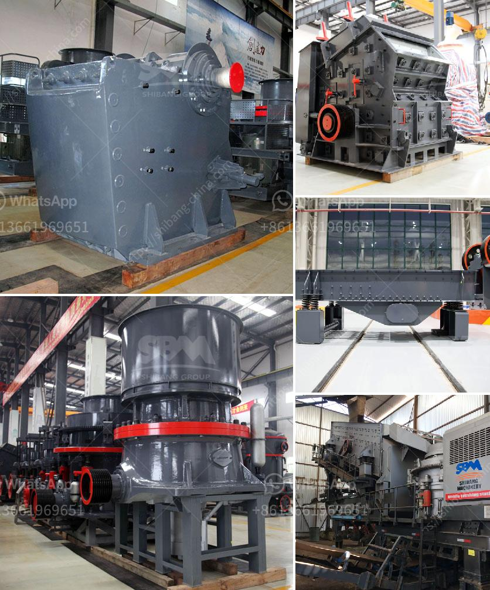

<h3>technical specification for ball mill</h3>
The ball mill is a key piece of equipment for grinding crushed materials, and it is widely used in production lines for powders such as cement, silicates, refractory material, fertilizer, glass ceramics, etc. as well as for ore dressing of both ferrous and non-ferrous metals. The ball mill can grind various ores and other materials either wet or dry.

There are two kinds of ball mills, grate type and overfall type, due to different ways of discharging material. The difference in speeds between the balls and grinding jars produces an interaction between frictional and impact forces, which releases high dynamic energies. The interplay between these forces produces the high and very effective degree of size reduction of the planetary ball mill.

Technical specifications of the ball mill may vary upon the intended purpose and duty cycle. The machine may be designed for continuous operation over long periods of time, or it may be operated in a batch mode for mixing and dispersing purposes. Either way, the ball mill requires careful planning, engineering, calculation, and accurate technical specifications.

1. Capacity: The tank or cylinder must have a sufficient capacity to hold the required amount of material to be ground. It is usually expressed in terms of volume, such as liters or gallons. The capacity can range from a few liters to several thousand liters, depending on the intended purpose of the ball mill.

2. Motor power: The motor power is an important factor in determining the efficiency and performance of the ball mill. It is usually measured in kilowatts (kW) or horsepower (HP). Higher motor power leads to faster and more efficient grinding.

3. Speed: The rotational speed of the ball mill is another important factor to consider when designing a ball mill. It is usually expressed in terms of revolutions per minute (rpm). The higher the speed, the more effective the grinding process. However, excessively high speeds can lead to excessive wear and tear of the grinding media.

4. Grinding media: The type and size of the grinding media used in the ball mill depend on the material being ground and the fineness required. Common grinding media materials include steel balls, ceramic balls, and natural stones. The size of the grinding media can range from several millimeters to a few micrometers.

5. Material of construction: The ball mill must be constructed using materials that are compatible with the material being ground. Common construction materials for ball mills include stainless steel, rubber, and ceramic. The choice of material depends on factors such as the corrosiveness of the material being ground and the desired final fineness.

In conclusion, the technical specifications for a ball mill will vary depending on the intended purpose. It is important to carefully consider factors such as capacity, motor power, speed, grinding media, and material of construction to ensure that the ball mill is suitable for the desired application. By selecting the appropriate specifications, one can maximize the efficiency and performance of the ball mill while minimizing operational and maintenance costs.
<h3>Contact us</h3><ul><li><strong>Whatsapp:&nbsp;<a href="https://wa.me/8613661969651">+8613661969651</a></strong></li><li><a href="https://swt.shibang-china.com/?git&amp;zhl&amp;technical specification for ball mill"><strong>Online Service(chat now)</strong></a></li></ul><h3>Related</h3><ul><li><a href='stone crusher plant components.md'>stone crusher plant components</a></li><li><a href='crushing plants for sale in south africa.md'>crushing plants for sale in south africa</a></li><li><a href='mobile crusher company.md'>mobile crusher company</a></li><li><a href='puzzolana 100tph cone crusher plant price.md'>puzzolana 100tph cone crusher plant price</a></li><li><a href='rock crushers manufacturers.md'>rock crushers manufacturers</a></li></ul>