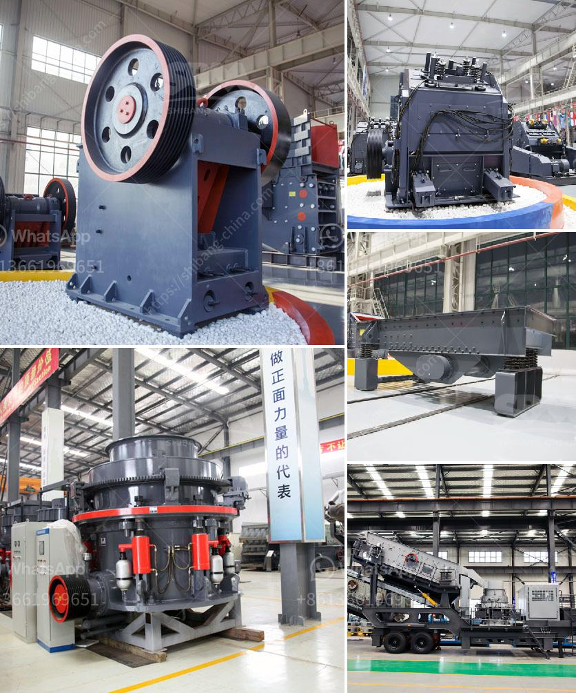

<h3>the company mines limestone in ethiopia</h3>
In recent years, Ethiopia has seen an impressive growth in its construction industry. The demand for construction materials, especially limestone, has significantly surged as the nation aims to develop its infrastructure and cater to its growing population's needs. One company that has been pivotal in meeting this demand is [Company Name], a leading limestone mining company operating in Ethiopia.

[Company Name] is renowned for its expertise in mining high-quality limestone, which is widely used in various construction projects, including road building, bridge construction, and the production of cement. The company's commitment to quality and sustainability has made it a preferred choice for many construction firms and government bodies.

The limestone mined by [Company Name] is primarily sourced from the abundant quarry sites in Ethiopia. Through careful extraction procedures, the company ensures that the limestone retains its structural integrity and superior quality. The mining process employed by [Company Name] adheres to strict environmental standards, mitigating any negative impact on the surroundings.

Another factor that sets [Company Name] apart is its commitment to corporate social responsibility (CSR). The company actively engages with local communities living near its mining sites, supporting education, healthcare, and infrastructure development initiatives. By empowering local communities, [Company Name] aims to foster long-lasting relationships and contribute to the overall sustainable growth of Ethiopia's mining sector.

Ethiopia's construction industry has experienced remarkable growth, with large-scale projects such as the Grand Ethiopian Renaissance Dam and Addis Ababa's urban expansion fueling the demand for limestone. [Company Name]'s consistent and reliable supply of high-quality limestone has proved instrumental in meeting this soaring demand and supporting the nation's infrastructure development goals.

Furthermore, the company's limestone mining operations have also created numerous employment opportunities for the local population. This not only helps to alleviate poverty but also contributes to the overall economic growth and development of the regions where [Company Name] operates.

In conclusion, [Company Name] plays a crucial role in Ethiopia's construction industry by providing high-quality limestone and supporting infrastructure development projects. Its commitment to sustainability and CSR initiatives sets it apart as a responsible mining company, contributing to both social and economic progress. As Ethiopia continues to invest in its infrastructure, the demand for limestone is poised to rise further, positioning [Company Name] as a key player in meeting this demand and helping the nation achieve its ambitious development goals.
<h3>Contact us</h3><ul><li><strong>Whatsapp:&nbsp;<a href="https://wa.me/8613661969651">+8613661969651</a></strong></li><li><a href="https://swt.shibang-china.com/?git&amp;zhl&amp;the company mines limestone in ethiopia"><strong>Online Service(chat now)</strong></a></li></ul><h3>Related</h3><ul><li><a href='how much can a quarry plant cost.md'>how much can a quarry plant cost</a></li><li><a href='chromite ore crusher in pakistan.md'>chromite ore crusher in pakistan</a></li><li><a href='tones per hour in limestone prduction.md'>tones per hour in limestone prduction</a></li><li><a href='complete gold refinery for sale in south africa.md'>complete gold refinery for sale in south africa</a></li><li><a href='working hours of a crusher plant.md'>working hours of a crusher plant</a></li></ul>