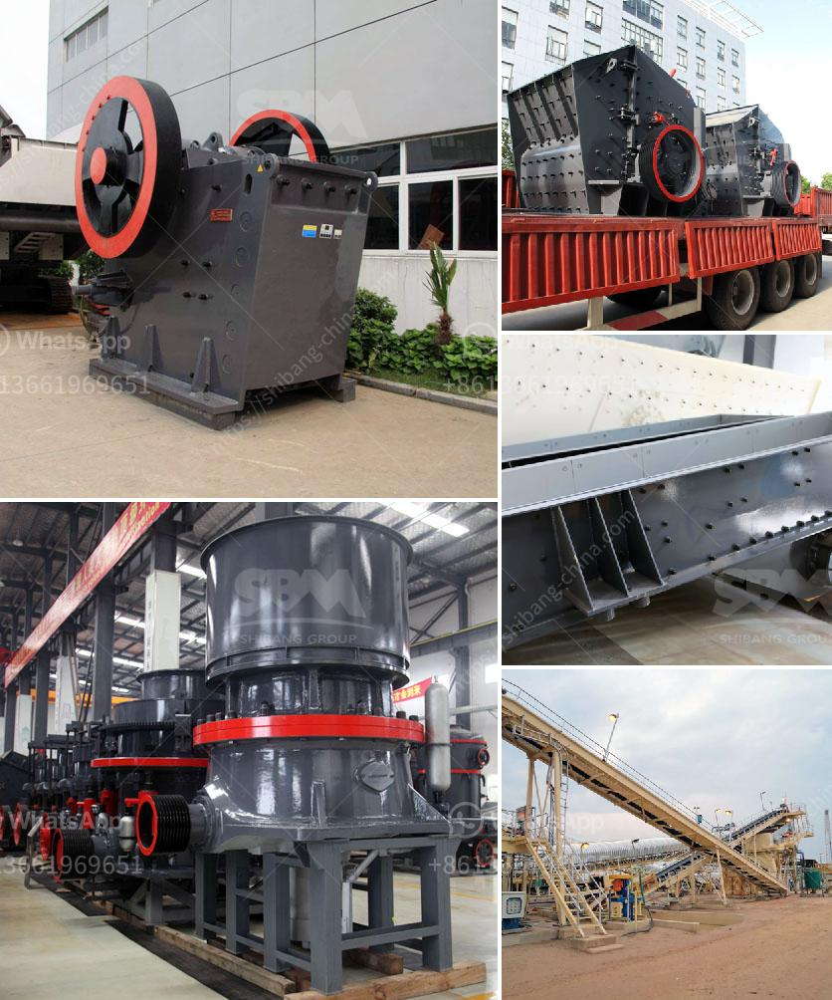

<h3>three roll mills supplier</h3>
Three roll mills are widely used in various industries, including cosmetics, chemicals, and pharmaceuticals, for the production of high-quality and precisely homogeneous products. These mills are specifically designed to grind, disperse, and refine viscous materials to achieve the desired consistency and texture.

When it comes to choosing a reliable three roll mills supplier, it is crucial to consider several factors to ensure the best quality and efficiency. One of the key aspects to look for in a supplier is their experience and expertise in the field. A supplier with extensive knowledge of the industry and a proven track record can provide valuable insights and guidance in selecting the most suitable mill for specific applications.

Another factor to consider is the quality of the equipment they offer. The supplier should provide mills that are manufactured using high-quality materials and advanced technology. This ensures durability, longevity, and optimal performance of the mills, even when used in demanding production processes.

Additionally, it is important to choose a supplier that offers comprehensive customer support and after-sales services. This includes technical assistance, maintenance, and spare parts availability. A reliable supplier will have a team of skilled technicians ready to offer guidance and support whenever needed, ensuring smooth operations and minimal downtime.

One reputable three roll mills supplier that meets all these criteria is [Supplier Name]. With years of experience in the industry, they are known for their exceptional customer service, top-quality equipment, and comprehensive after-sales support. They offer a wide range of three roll mills that cater to diverse applications and production requirements.

In conclusion, selecting the right three roll mills supplier is essential for obtaining high-quality and efficient equipment. Considering factors such as experience, equipment quality, and customer support will help in making an informed decision. [Supplier Name] stands out as a reliable supplier that offers top-notch products and excellent services, making them an ideal choice for any industry requiring three roll mills.
<h3>Contact us</h3><ul><li><strong>Whatsapp:&nbsp;<a href="https://wa.me/8613661969651">+8613661969651</a></strong></li><li><a href="https://swt.shibang-china.com/?git&amp;zhl&amp;three roll mills supplier"><strong>Online Service(chat now)</strong></a></li></ul><h3>Related</h3><ul><li><a href='ball mill drive system.md'>ball mill drive system</a></li><li><a href='washing process of chromite ore beneficiation.md'>washing process of chromite ore beneficiation</a></li><li><a href='jaw crusher for rent indonesia.md'>jaw crusher for rent indonesia</a></li><li><a href='calcite crusher machine.md'>calcite crusher machine</a></li><li><a href='belt conveyors used in crushing plant.md'>belt conveyors used in crushing plant</a></li></ul>