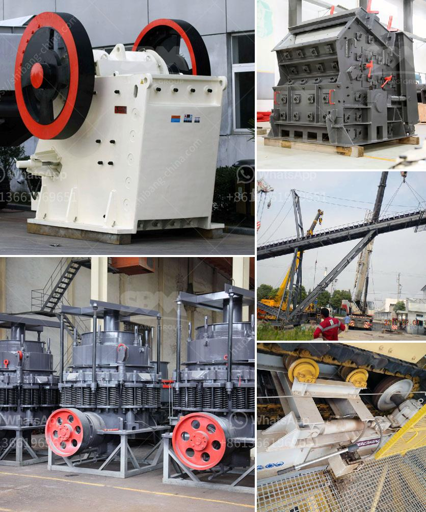

<h3>to buy second hand cement plant in india</h3>
India's rapid infrastructure development and rising construction activities have propelled the country's cement industry to new heights. However, setting up a new cement manufacturing facility can be a capital-intensive process. In such a scenario, purchasing a second-hand cement plant can offer significant cost benefits and expedited entry into the industry. This article explores why buying second-hand cement plants in India can be a smart choice for businesses looking to capitalize on the nation's growing cement demand.

Investing in a second-hand cement plant allows businesses to save a substantial amount of money compared to the establishment of a new facility. When manufactured according to high-quality standards, these pre-owned plants can deliver desirable production capacity at a fraction of the cost. Additionally, the initial investment in a second-hand cement plant can be significantly lower, enabling businesses to allocate their resources to other areas such as marketing, distribution, and workforce training.

The cement industry in India is highly competitive, and time is a crucial factor for success. Acquiring a second-hand plant eliminates the time-consuming stages involved in plant design, layout, and regulatory approvals. By purchasing an already established cement plant, businesses can expedite their market entry and start production within a shorter span. This allows them to benefit from the growing demand promptly, generating revenue and establishing their presence in the market.

Many second-hand cement plants available for purchase in India are still in excellent operational condition. These plants have proven their productivity and quality over the years and can offer businesses a head start in meeting customer demands. Moreover, experienced technical teams are often available to provide essential training, ongoing support, and maintenance assistance to ensure uninterrupted operations.

Investing in a second-hand cement plant in India can be a wise choice for businesses aiming to enter the booming cement industry without bearing the burden of excessive capital expenditure and time-consuming set-up procedures. The cost savings, faster market entry, and potential for operational efficiency offered by pre-owned cement plants make them an attractive option for growth-oriented companies. However, thorough due diligence on the plant's condition, past performance, and associated documentation is crucial before making a purchase. By approaching this investment opportunity with diligence and prudence, businesses can position themselves effectively in India's thriving cement market.
<h3>Contact us</h3><ul><li><strong>Whatsapp:&nbsp;<a href="https://wa.me/8613661969651">+8613661969651</a></strong></li><li><a href="https://swt.shibang-china.com/?git&amp;zhl&amp;to buy second hand cement plant in india"><strong>Online Service(chat now)</strong></a></li></ul><h3>Related</h3><ul><li><a href='crushing plant zenith.md'>crushing plant zenith</a></li><li><a href='powder production line price.md'>powder production line price</a></li><li><a href='cement plant process flow diagram ppt.md'>cement plant process flow diagram ppt</a></li><li><a href='copper ore ball mill.md'>copper ore ball mill</a></li><li><a href='standard operating procedure of ball mill.md'>standard operating procedure of ball mill</a></li></ul>