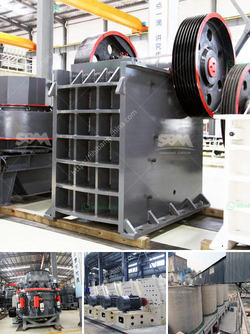

<h3>ton per hour stone crusher plant</h3>
Stone crusher plant is a profitable venture for new entrepreneurs. The demand for quality stone chips is increasing day-by-day. Stone Crusher Plant Market Opportunity. All the building constructions whether it is housing or industrial construction activities requires crushed stone. Crushed stone is also required for cement based products like RCC pipes, PSC poles, cement concrete hollow blocks, precast cement concrete slabs, well rings, window & door frames and road laying. The demand for crushed stone will continue to grow with the growth of its user industry.

One of the most particular and general but most important materials used for making concrete is stone chips. This particular material is known as 'Crusher Run' or 'Quarry Processed Aggregates'. Crushed stone is segregated into various sizes like 35mm, 20mm, 12mm, etc for different uses.

The cost of stone crusher plant has always been one of the key topics that the customers need to consider.Generally,it is affected by the following factors, such as crusher type, specific crusher model,crusher manufacturer,shipment,brand,etc

The raw material scale you need to process decides the crusher type and specific model you need to choose. If you need a medium scale and large size crusher machine, the cost of stone crusher plant is up to the crusher type you choose.PE-600×900 jaw crusher,PY1200 series cone crusher, mobile crusher are the hot sale ones. If you need larger production capacity, we also have the related crusher size for you to choose.The cost of the stone crusher plant is also different among the different crusher types and specific crusher models

The 300 tph-400 tph stone crushing plant is widely used as sand making line, stone crushing plant, ore dressing line, aggregate production line, construction waste recycling plant and so on. For the contractors and final users, SBM Machinery has designed complete stationary, portable, mobile crushing plants.

The 400 tph crushing plant is widely applied in sand making, stone crushing, aggregate production, waste concrete recycle and ore dressing process. No matter for small scale or large scale stone crushing plants, SBM professionals can help desi

More detailed information can be found in the user manual. The manufacturer will provide the information on the crushing machine, in this case, stone crusher, to the users. More importantly, the information will provide the customer with a strategy to run the plant efficiently. Knowing the exact user information will be great for the manufacturer as this will help him make the best stone crusher plant purchase.

To sum up, buying a stone crusher plant is useful unless you are short of money. As for the same question, whether big or small, you will get answers from different providers. Hence, it is best to research and find the stone crusher plant providers th
<h3>Contact us</h3><ul><li><strong>Whatsapp:&nbsp;<a href="https://wa.me/8613661969651">+8613661969651</a></strong></li><li><a href="https://swt.shibang-china.com/?git&amp;zhl&amp;ton per hour stone crusher plant"><strong>Online Service(chat now)</strong></a></li></ul><h3>Related</h3><ul><li><a href='artificial sand project.md'>artificial sand project</a></li><li><a href='gold mill tailings processing equipment.md'>gold mill tailings processing equipment</a></li><li><a href='lippman jaw crusher for sale.md'>lippman jaw crusher for sale</a></li><li><a href='stone crusher pfs price.md'>stone crusher pfs price</a></li><li><a href='decibels generated by hebro jaw crusher.md'>decibels generated by hebro jaw crusher</a></li></ul>