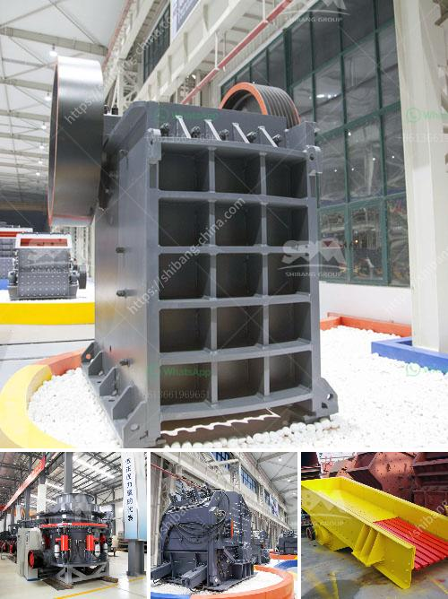

<h3>tones per hour in limestone prduction</h3>
Limestone is a sedimentary rock composed mainly of calcium carbonate (CaCO3). It is one of the most common rocks in the world and is primarily used in the construction industry for various purposes, including the production of cement, mortar, and sand. As demand for limestone continues to grow, maximizing its production efficiency has become a priority for many mining companies. One key metric that aids in this process is tons per hour (TPH), which measures the amount of limestone produced in an hour. In this article, we will explore the significance of TPH in limestone production and discuss strategies to enhance it.

TPH plays a vital role in determining the profitability and effectiveness of limestone production. The higher the TPH rate, the greater the revenue potential from selling limestone within a given time frame. A higher TPH also implies an increased efficiency in the mining and processing of limestone, resulting in reduced costs per ton. Therefore, mining companies are continuously seeking ways to improve their TPH rates to ensure higher production levels and remain competitive in the market.

Several factors influence TPH in limestone production. Firstly, the efficiency of the crushing and screening process is crucial. These two stages are responsible for breaking down large limestone rocks into smaller sizes suitable for further processing. By using advanced machinery and optimizing the workflow, mining companies can ensure smoother operations, speeding up the overall production process and increasing TPH.

Furthermore, regular equipment maintenance is essential to prevent breakdowns and downtime, which can significantly impact TPH rates. Equipment failure not only hampers production but also incurs additional repair costs. Implementing a robust maintenance schedule and promptly addressing any issues that arise will help maximize operational efficiency and ultimately boost TPH rates.

The geology and quality of the limestone deposit also affect TPH rates. A higher-quality deposit means that less material needs to be processed to meet the desired specifications, thus increasing TPH. Additionally, knowledge of the deposit's characteristics helps in strategic planning and optimizing the mining process to extract limestone more efficiently.

Mining companies can adopt various strategies to enhance TPH rates. One approach is investing in modern and efficient equipment. Cutting-edge technology, such as high-capacity crushers and conveyor systems, can substantially increase production rates. These advanced technologies minimize downtime, maximize throughput, and improve overall efficiency.

Another strategy is streamlining the production process, from mining to transportation. Removing bottlenecks and optimizing workflows ensures a smooth and continuous operation, resulting in higher TPH rates. Employing automation and integrating software systems can provide real-time data monitoring and analysis, enabling companies to identify and address any inefficiencies promptly.

Lastly, workforce training and development play a crucial role in improving TPH rates. Well-trained and knowledgeable personnel can identify potential issues, perform routine maintenance, and operat
<h3>Contact us</h3><ul><li><strong>Whatsapp:&nbsp;<a href="https://wa.me/8613661969651">+8613661969651</a></strong></li><li><a href="https://swt.shibang-china.com/?git&amp;zhl&amp;tones per hour in limestone prduction"><strong>Online Service(chat now)</strong></a></li></ul><h3>Related</h3><ul><li><a href='limestone crusher manufacturers price.md'>limestone crusher manufacturers price</a></li><li><a href='company of stone crusher.md'>company of stone crusher</a></li><li><a href='dry ball milling process.md'>dry ball milling process</a></li><li><a href='used vibro screener for sale.md'>used vibro screener for sale</a></li><li><a href='stone crushers in china.md'>stone crushers in china</a></li></ul>