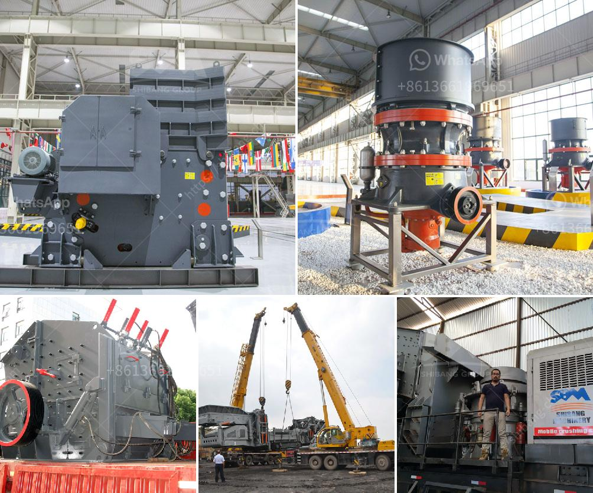

<h3>tons stationary impact granite crusher</h3>
In the realm of construction and mining industries, the need for effective crushing equipment cannot be emphasized enough. Granites, with their durability and aesthetic appeal, have become a popular choice for both residential and commercial projects. To meet the ever-increasing demand for granite products, an essential piece of machinery has emerged: the tons stationary impact granite crusher. Harnessing its immense power, this machine turns mountains of granite into tiny, refined pebbles, making construction projects more efficient and cost-effective.

The tons stationary impact granite crusher is specifically designed for the rigid and heavy-duty nature of granite crushing tasks. Offering immense power and efficiency, it effortlessly breaks down even the toughest granite boulders into pebbles of various sizes, suitable for different construction applications.

Equipped with a robust frame and reinforced components, the tons stationary impact granite crusher can withstand enormous amounts of pressure and stress during the crushing process. The machine's design ensures minimal downtime, high operational efficiency, and reduced maintenance requirements, making it the ideal workhorse for demanding granite crushing operations.

This stationary impact granite crusher utilizes a rotor equipped with heavy-duty hammers that strike the granite material at high speeds. The impact force generated by the hammers effectively shatters the granite into smaller fragments. As the granite is subjected to multiple crushing impacts, it gradually undergoes size reduction, until it reaches a predetermined size suitable for the intended construction application.

The tons stationary impact granite crusher offers exceptional versatility due to its ability to crush a wide range of other materials besides granite. From limestone and basalt to concrete and asphalt, this crusher is a go-to solution for diverse crushing requirements. Construction companies can rely on this equipment to tackle various projects without the need for additional machinery, ultimately saving costs and enhancing productivity.

In addition to its performance and versatility, the tons stationary impact granite crusher also prioritizes environmental concerns. Employing advanced technology, this crusher is designed to minimize noise pollution and dust emissions during the crushing process, maintaining a sustainable and eco-friendly operation. Such advancements align with the construction industry's growing focus on environmentally conscious practices.

The tons stationary impact granite crusher is a game-changer in the construction and mining industries, offering exceptional power, performance, and versatility. With its ability to turn mountains of granite into refined pebbles, this machinery revolutionizes the crushing process, making it more efficient, cost-effective, and eco-friendly. As the demand for granite products continues to grow, embracing the capabilities of the stationary impact granite crusher ensures construction companies stay ahead in this competitive market.

In summary, if you are seeking a reliable, durable, and efficient device to crush granite for your construction projects, look no further than the tons stationary impact granite crusher – a true giant in the realm of crushing machinery.
<h3>Contact us</h3><ul><li><strong>Whatsapp:&nbsp;<a href="https://wa.me/8613661969651">+8613661969651</a></strong></li><li><a href="https://swt.shibang-china.com/?git&amp;zhl&amp;tons stationary impact granite crusher"><strong>Online Service(chat now)</strong></a></li></ul><h3>Related</h3><ul><li><a href='mobile crusher wanted for rent in johor.md'>mobile crusher wanted for rent in johor</a></li><li><a href='hammer mill 200 mesh.md'>hammer mill 200 mesh</a></li><li><a href='cement manufacturing process ppt.md'>cement manufacturing process ppt</a></li><li><a href='potassium ore production equipment.md'>potassium ore production equipment</a></li><li><a href='bentonite powder machine.md'>bentonite powder machine</a></li></ul>