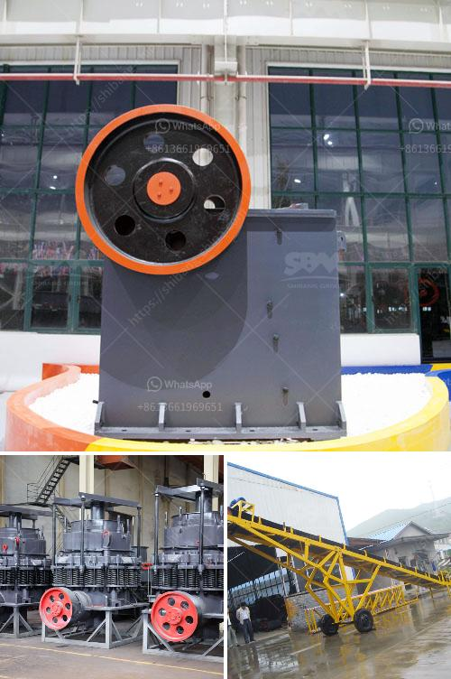

<h3>tph granite crushing plant for sale</h3>
Are you searching for a tph granite crushing plant for sale that can effectively process and crush granite into various sizes? Then look no further as we are here to offer you a comprehensive guide to acquiring the best equipment for your granite crushing needs. Granite is a popular material used for various construction purposes due to its durability and aesthetic appeal. Hence, investing in a granite crushing plant is a profitable venture.

Firstly, let's understand what a tph granite crushing plant entails. TPH stands for tons per hour and refers to the capacity of the crushing plant. In this context, a granite crushing plant includes a jaw crusher, cone crusher or impact crusher, vibrating feeder, vibrating screen, and belt conveyor.

To ensure that the granite crushing plant can withstand various environmental conditions and continuously operate efficiently, several factors need to be considered before purchasing:

1. Raw Material Properties: Granite is a hard and dense material, making it challenging to process. To choose the appropriate granite crushing plant, you need to know the average size, hardness, and composition of the granite you aim to crush. The type and quality of the granite will influence the selection of equipment and plant configuration.

2. Crushing Capacity: Consider the required production capacity or the number of tons of crushed granite required per hour. Identify if your granite crushing needs fall within the range of 200-500 tons per hour. This will help you select a suitable granite crushing plant with the desired capacity.

3. Production Process and Equipment Configuration: There are various ways to process granite, including primary crushing, secondary crushing, tertiary crushing, and screening. Depending on the intended use and final product specifications, you can choose a jaw crusher for primary crushing, cone crusher or impact crusher for secondary crushing, and vibrating screen to screen the crushed materials. Conveyor belts and vibrating feeders ensure a continuous supply of raw materials.

4. Quality of Equipment: For the best results, invest in high-quality granite crushing equipment. Look for renowned suppliers or manufacturers who adhere to international quality standards. Superior equipment will not only ensure high productivity but also reduce maintenance and operation costs in the long run.

5. Energy Efficiency and Environmental Considerations: Opt for a granite crushing plant that prioritizes energy efficiency and minimizes environmental impacts. Look for features such as low power consumption, reduced dust emissions, and noise control mechanisms.

It is essential to compare and evaluate different granite crushing plant options, considering factors like design, cost, after-sales service, and warranty. Don't hesitate to consult industry experts and seek their advice during the selection process.

Remember, purchasing a tph granite crushing plant is a significant investment that will impact your future operations. Hence, it's crucial to make an informed decision that aligns with your specific requirements.

In conclusion, a tph granite crushing plant for sale is a wise investment if you're in the construction or mining industry. With the right equipment and proper planning, you can process granite efficiently and enhance your business profitability. Make sure to consider the raw material properties, crushing capacity, equipment configuration, and quality before finalizing your purchase. Invest in a reliable and energy-efficient plant that meets your needs while reducing environmental impacts.
<h3>Contact us</h3><ul><li><strong>Whatsapp:&nbsp;<a href="https://wa.me/8613661969651">+8613661969651</a></strong></li><li><a href="https://swt.shibang-china.com/?git&amp;zhl&amp;tph granite crushing plant for sale"><strong>Online Service(chat now)</strong></a></li></ul><h3>Related</h3><ul><li><a href='ball mill working in hindi.md'>ball mill working in hindi</a></li><li><a href='primary impact crusher.md'>primary impact crusher</a></li><li><a href='stone ball mill up to 2500 mesh.md'>stone ball mill up to 2500 mesh</a></li><li><a href='calcium carbonate grinding ball mill.md'>calcium carbonate grinding ball mill</a></li><li><a href='crushers and feeders in south africa.md'>crushers and feeders in south africa</a></li></ul>