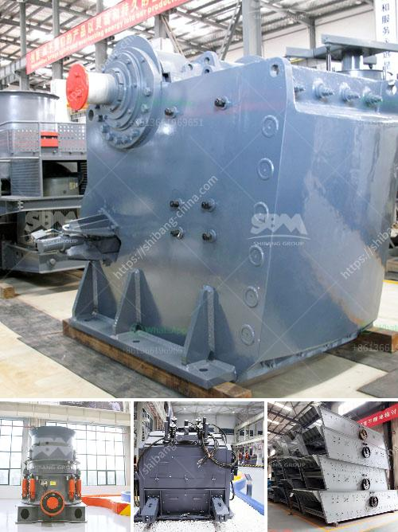

<h3>tph mobile crushing plant</h3>
The mobile crushing plant is an innovative piece of machinery designed to transform large stones into tiny pieces. The equipment has a compact design that takes up minimal space and offers great mobility to the operators. These advantages have led to an increased adoption of mobile crushing plants in various industries.

Amongst the various types of mobile crushing plants available in the market, the TPH mobile crushing plant is particularly popular. This plant boasts a flexible configuration that allows users to choose between different crushing units to meet their specific needs. Whether it is crushing contractors, mining companies, or quarry operators, the TPH mobile crushing plant provides a reliable and efficient solution.

One of the key features of the TPH mobile crushing plant is its versatility. With this equipment, users can easily switch between primary, secondary, and tertiary crushing stages, depending on the application. This ensures that the crushed stones are of the desired size and meet the quality requirements.

Furthermore, the TPH mobile crushing plant offers exceptional throughput and productivity. With its powerful engine, it can process a wide range of materials at a rapid pace. This enables operators to maximize their production output and meet tight deadlines. Moreover, the plant's low fuel consumption and emission levels make it an environmentally friendly choice.

In terms of maintenance, the TPH mobile crushing plant is designed for ease of use. It features a user-friendly control panel that allows operators to monitor and control the equipment effortlessly. Additionally, the plant is equipped with advanced safety features to protect the operators and prevent accidents.

In conclusion, the TPH mobile crushing plant has revolutionized the stone crushing industry. Its versatility, high productivity, and environmental benefits make it a game-changer in the market. Whether it is for construction projects or mining operations, this plant offers a cost-effective and efficient solution. With its compact design and great mobility, it is the go-to choice for companies looking to enhance their stone crushing capabilities.
<h3>Contact us</h3><ul><li><strong>Whatsapp:&nbsp;<a href="https://wa.me/8613661969651">+8613661969651</a></strong></li><li><a href="https://swt.shibang-china.com/?git&amp;zhl&amp;tph mobile crushing plant"><strong>Online Service(chat now)</strong></a></li></ul><h3>Related</h3><ul><li><a href='starting of ball mill with vfd.md'>starting of ball mill with vfd</a></li><li><a href='crusher manufacturing companies in india.md'>crusher manufacturing companies in india</a></li><li><a href='stone crusher portable.md'>stone crusher portable</a></li><li><a href='process of limestone crusher.md'>process of limestone crusher</a></li><li><a href='crushing machine company.md'>crushing machine company</a></li></ul>