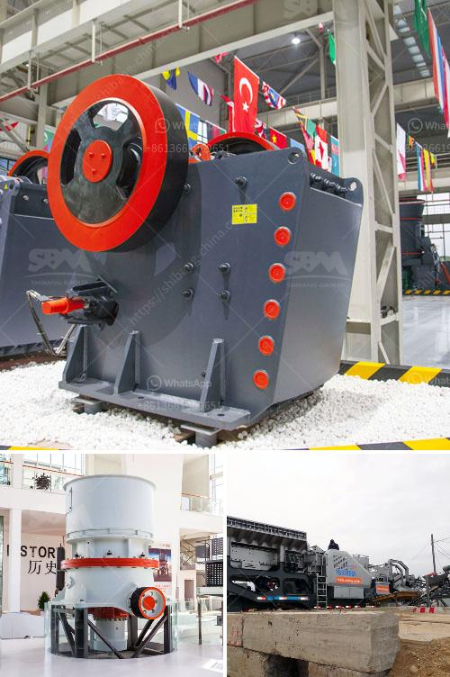

<h3>track mounted mobile crusher plant</h3>
Track-mounted mobile crushing plant is a mobile crushing and screening equipment totally hydraulic and crawls with pedrail, which is a new designed rock crushing and screening equipment, integrating the preferences of mining and recycling industry as well as other industrial constructions. This mobile crusher plant is widely used in mining, coal mining, construction waste recycling and other industries, which can effectively crush and screen various materials such as limestone, marble, granite, basalt, river stone, etc.

The track-mounted mobile crushing plant is a mobile crushing and screening equipment totally hydraulic and crawls with pedrail, and it is widely used in mining, coal mine and construction waste recycling. It has been designed to stand alone touch operations, high mobility which are particularly suited for construction waste recycling. It also can save a large construction capital and relocation. It adopts the motor of high-torque, which makes the conveyor belt more stable and prolongs its service life greatly. The track-mounted mobile crushing and screening plant can be widely applied in road construction, mining, building, metallurgy, energy and other industries.

1. High mobility: The track-mounted mobile crushing and screening plant is designed to feature movement flexibility, which enables it to be relocated freely and easily. In this way, it can save a large construction capital and relocation.

2. High efficiency: The track-mounted mobile crushing and screening plant can directly crush the materials on site, eliminating the need to transport the materials to the site and then crushing. It not only reduces the transportation cost but also improves the working efficiency.

3. Effective screening: The track-mounted mobile crushing and screening plant can screen the crushed materials into different specifications according to customer's requirement. It can be used in various industries, such as construction waste recycling, mining, quarrying, and more.

4. Low fuel consumption: The track-mounted mobile crushing and screening plant uses diesel as the main power source. It not only reduces the energy consumption but also reduces the emissions. This is beneficial for environmental protection.

In summary, the track-mounted mobile crushing and screening plant is a versatile and flexible equipment that can meet the requirements of different customers. It not only achieves the goals of crushing and screening, but also brings convenience and efficiency to customers. With its high mobility, high efficiency, effective screening, and low fuel consumption, the track-mounted mobile crushing and screening plant has become the preferred equipment in the mining, coal mining and construction waste recycling industry.
<h3>Contact us</h3><ul><li><strong>Whatsapp:&nbsp;<a href="https://wa.me/8613661969651">+8613661969651</a></strong></li><li><a href="https://swt.shibang-china.com/?git&amp;zhl&amp;track mounted mobile crusher plant"><strong>Online Service(chat now)</strong></a></li></ul><h3>Related</h3><ul><li><a href='how much does it cost to rent a stone crusher.md'>how much does it cost to rent a stone crusher</a></li><li><a href='how to make clay powder machine.md'>how to make clay powder machine</a></li><li><a href='eco stone crusher.md'>eco stone crusher</a></li><li><a href='crusher plant equipment supplier in saudi arabia.md'>crusher plant equipment supplier in saudi arabia</a></li><li><a href='manganese wash plant zambia.md'>manganese wash plant zambia</a></li></ul>