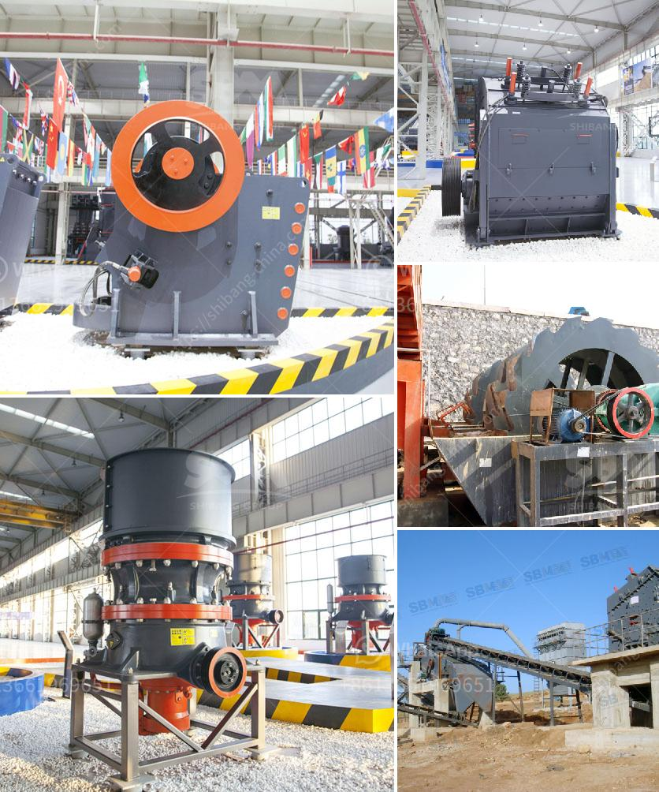

<h3>two pass roller mill</h3>
In the world of milling and grain processing, efficiency is key. As technology continues to advance, new innovations are constantly emerging to streamline and enhance the milling process. One such revolutionary advancement is the two-pass roller mill.

Traditionally, milling has been a complex and time-consuming process involving multiple stages to achieve the desired refined grain. However, the two-pass roller mill has changed the game by reducing the process to just two simple steps, resulting in significant time and energy savings.

So, what exactly is a two-pass roller mill? Essentially, it is a machine that combines multiple milling processes into a single streamlined operation. It consists of two rolls that rotate in opposite directions at different speeds. The first pass through the rolls cracks the grain, while the second pass reduces it to the desired particle size.

The benefits of this innovative technology are numerous. Firstly, it eliminates the need for intermediate sifting or grinding stages, resulting in a more efficient and cost-effective milling process. By reducing the number of steps required, the two-pass roller mill enables mills to save time, energy, and resources, ultimately leading to higher production rates.

Additionally, the two-pass roller mill is highly versatile and adaptable to various types of grains and other materials. This makes it an ideal solution for milling a wide range of products, from wheat and corn to barley and rice. The ability to handle different grains with ease makes it a valuable asset for both large-scale industrial mills and smaller, specialized operations.

Another advantage of the two-pass roller mill is its superior control over particle size distribution. With separate adjustments for each roll, mill operators have precise control over the final product's characteristics. This allows for consistent quality and ensures that the final grain meets the desired specifications.

Moreover, the two-pass roller mill boasts high extraction rates, resulting in maximum yield and minimization of waste. The double-pass design enables efficient extraction of starch, proteins, and other valuable components from the grain, making it a highly efficient option for milling operations.

In terms of maintenance, the two-pass roller mill offers simplicity and ease of use. Unlike traditional milling machines that require complex setups and frequent adjustments, this innovative technology is designed for minimal maintenance and easy operation. This makes it an attractive solution for mills seeking to streamline their operations and maximize productivity.

In conclusion, the two-pass roller mill is a game-changer in the milling industry. By combining multiple milling processes into a single, efficient operation, it significantly reduces time and energy requirements while delivering consistent, high-quality results. With its versatile capabilities and easy maintenance, this innovative technology is set to revolutionize the way grains are milled, enabling mills to optimize their operations and reach new levels of productivity.
<h3>Contact us</h3><ul><li><strong>Whatsapp:&nbsp;<a href="https://wa.me/8613661969651">+8613661969651</a></strong></li><li><a href="https://swt.shibang-china.com/?git&amp;zhl&amp;two pass roller mill"><strong>Online Service(chat now)</strong></a></li></ul><h3>Related</h3><ul><li><a href='quarry crushing equipment.md'>quarry crushing equipment</a></li><li><a href='steel rolling mill plant suppliers.md'>steel rolling mill plant suppliers</a></li><li><a href='limestone processing equipment.md'>limestone processing equipment</a></li><li><a href='mobile crusher for rent in uae.md'>mobile crusher for rent in uae</a></li><li><a href='germany rocks crushers.md'>germany rocks crushers</a></li></ul>