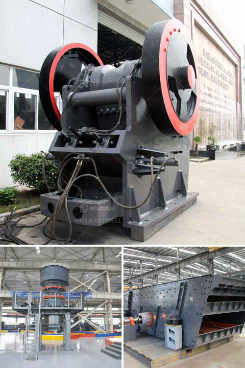

<h3>two prefabricated concrete production line</h3>
Prefabricated concrete production lines have revolutionized the construction industry, allowing for faster and more efficient building processes. These production lines consist of advanced machinery and equipment that can produce high-quality precast concrete elements with precision and speed. In this article, we will explore two prefabricated concrete production lines that have garnered attention for their impressive capabilities.

The first production line is equipped with state-of-the-art concrete mixing and batching systems. This allows for the precise formulation of concrete mixtures, ensuring consistent quality throughout the production process. The automated batching system allows for accurate measurement of raw materials, minimizing wastage and reducing costs. Additionally, the mixer ensures that the mixture is thoroughly blended, resulting in concrete with excellent strength and durability.

The second production line focuses on the molding and casting of precast concrete elements. It is equipped with advanced mold-making technology that allows for the creation of intricate and customized designs. This production line can manufacture a wide range of precast concrete elements, including walls, beams, columns, and facades. The molds are made to exact specifications, guaranteeing precision and accuracy in the final products.

Both production lines are designed for high productivity, with a capacity to produce a large volume of precast concrete elements in a short period of time. This is achieved through a combination of automation and advanced machinery. The continued advancement of technology has led to the development of production lines that can achieve high levels of efficiency and output, reducing labor requirements and increasing overall productivity.

Prefabricated concrete production lines offer several advantages over traditional construction methods. Firstly, they allow for simultaneous production and installation, reducing construction time significantly. This is particularly beneficial for large-scale projects where time is of the essence. Secondly, the quality of precast concrete elements is consistently high due to the controlled manufacturing environment. The use of standardized molds and strict quality control measures ensures that each element meets the required specifications. Lastly, prefabricated concrete elements are more durable and resistant to environmental factors such as moisture, fire, and pests.

In conclusion, precast concrete production lines have revolutionized the construction industry by offering faster, more efficient, and higher-quality building processes. The two production lines mentioned in this article exemplify the advanced technology and capabilities of prefabricated concrete production. With their ability to produce a large volume of high-quality precast concrete elements, these production lines are playing a pivotal role in shaping the future of construction. As technology continues to evolve, we can expect even more impressive advancements in the field of prefabricated concrete production.
<h3>Contact us</h3><ul><li><strong>Whatsapp:&nbsp;<a href="https://wa.me/8613661969651">+8613661969651</a></strong></li><li><a href="https://swt.shibang-china.com/?git&amp;zhl&amp;two prefabricated concrete production line"><strong>Online Service(chat now)</strong></a></li></ul><h3>Related</h3><ul><li><a href='manufacture of conveyor belts in bogota.md'>manufacture of conveyor belts in bogota</a></li><li><a href='processing plan for feldspar ore.md'>processing plan for feldspar ore</a></li><li><a href='stamp mills for sale in zimbabwe.md'>stamp mills for sale in zimbabwe</a></li><li><a href='track mounted mobile crusher plant.md'>track mounted mobile crusher plant</a></li><li><a href='kenya vibrating screen is manufactured.md'>kenya vibrating screen is manufactured</a></li></ul>