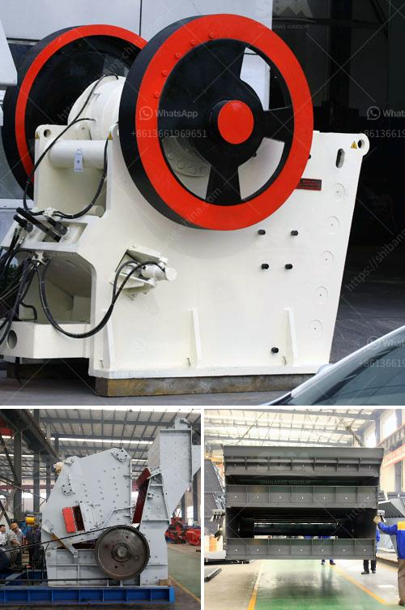

<h3>two roll mill supply in sri lanka</h3>
Sri Lanka's industrial sector has witnessed remarkable growth in recent years, fueled by a promising business environment and government initiatives. Within this thriving landscape, the two roll mill emerges as a key equipment that enables efficient and quality rubber processing. In this article, we delve into the significance of the two roll mill supply in Sri Lanka, exploring its advantages for the industry.

The two roll mill, often referred to as a rubber mixer, plays a crucial role in Sri Lanka's rubber industry. This machine allows efficient processing of rubber compounds, enhancing the production line's overall performance. With its unique ability to homogenize compounds, the two roll mill ensures consistent mixing of ingredients, leading to improved batch uniformity and reduced rejects. This advanced equipment enables manufacturers to optimize their output while maintaining product integrity, ultimately enhancing the competitiveness of the Sri Lankan rubber industry.

One of the distinguishing features of the two roll mill is its capability to produce high-quality compounds suitable for various rubber-based products. For instance, in Sri Lanka's tire manufacturing sector, the two roll mill is widely used to produce elastomers with superior properties such as excellent abrasion resistance, durability, and tensile strength. The precise control provided by this equipment ensures the desired properties are achieved consistently, contributing to the production of durable and reliable tires – a vital component in Sri Lanka's automotive industry.

The two roll mill's speed and efficiency significantly contribute to increased productivity, making it a valuable asset for Sri Lankan manufacturers. Unlike traditional batch processing methods, which can be time-consuming, the two roll mill allows for continuous mixing and processing, reducing cycle times and improving overall efficiency. Additionally, the easy operability and low maintenance requirements of this equipment enable manufacturers to maintain higher production levels, meeting market demands promptly. The increased productivity facilitated by the two roll mill strengthens Sri Lanka's industrial capabilities and fosters economic growth.

Recognizing the importance of this equipment, Sri Lanka has been actively promoting the local manufacturing and supply chain of two roll mills. The government's support for domestic machinery manufacturers assists in developing a robust local market, reducing reliance on imports while stimulating economic growth. Consequently, local manufacturers can provide cost-effective equipment and timely aftersales services, fueling the expansion of Sri Lanka's industrial sector. Moreover, a secure local supply chain ensures uninterrupted access to two roll mills, avoiding potential disruptions from global market fluctuations.

The two roll mill supply in Sri Lanka has become vital for the nation's industrial growth. Its ability to enhance rubber processing efficiency, ensure high-quality output, increase productivity, and support local manufacturing demonstrates its significance in the country's industrial landscape. By leveraging this advanced machinery, Sri Lankan manufacturers are well-positioned to excel in the international market, driving further economic progress.
<h3>Contact us</h3><ul><li><strong>Whatsapp:&nbsp;<a href="https://wa.me/8613661969651">+8613661969651</a></strong></li><li><a href="https://swt.shibang-china.com/?git&amp;zhl&amp;two roll mill supply in sri lanka"><strong>Online Service(chat now)</strong></a></li></ul><h3>Related</h3><ul><li><a href='ultrafine powder mill.md'>ultrafine powder mill</a></li><li><a href='coal mill crusher for sale stone crusher machine.md'>coal mill crusher for sale stone crusher machine</a></li><li><a href='ore crushing machine.md'>ore crushing machine</a></li><li><a href='harga stone crusher 250 ton jam indonesia.md'>harga stone crusher 250 ton jam indonesia</a></li><li><a href='small scale gold refinery plant equipments.md'>small scale gold refinery plant equipments</a></li></ul>