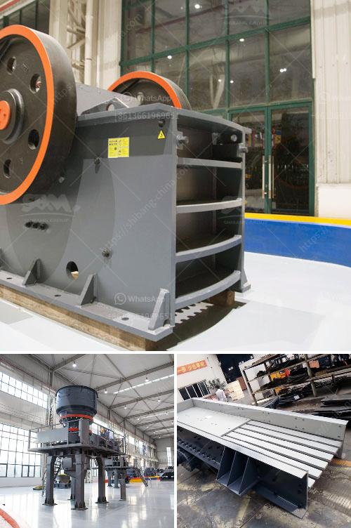

<h3>types conveyor belts</h3>
Conveyor belts play a crucial role in various industries, facilitating the smooth and efficient transportation of materials. Different industries require different types of conveyor belts, each designed to meet specific requirements. Here, we will explore some common types of conveyor belts and their applications.

The first type is the flat belt conveyor. As the name suggests, this belt is flat, making it suitable for transporting materials with a flat base. Flat belt conveyors are commonly used in the food processing, packaging, and automotive industries.

Next, we have the troughed belt conveyor. This type of belt features a series of idlers that form a trough shape, allowing for the transportation of bulk materials. Troughed belt conveyors are commonly used in mining, agriculture, and recycling industries.

For industries that require the transportation of heavy materials, such as construction and mining, the heavy-duty belt conveyor is the ideal choice. These belts are made from durable materials that can withstand high loads and rough conditions.

For applications that involve steep inclines or declines, the inclined belt conveyor is used. It is equipped with cleats or partitions to ensure that the materials being transported stay in place. Inclined belt conveyors find applications in industries like agriculture, construction, and mining.

Another type of conveyor belt is the magnetic belt conveyor. This belt utilizes magnets to attract materials, making it especially useful in industries like recycling, metalworking, and mining.

Lastly, we have the roller conveyor, which features a series of rollers instead of a belt. This type of conveyor is widely used in warehouses and distribution centers for transporting packages and pallets.

In conclusion, conveyor belts are essential tools in various industries, enabling the efficient movement of materials. From flat and troughed belts to heavy-duty and magnetic belts, each type has its own unique applications. Understanding the different types of conveyor belts helps industries select the right option to optimize their operations and ensure smooth material transportation.
<h3>Contact us</h3><ul><li><strong>Whatsapp:&nbsp;<a href="https://wa.me/8613661969651">+8613661969651</a></strong></li><li><a href="https://swt.shibang-china.com/?git&amp;zhl&amp;types conveyor belts"><strong>Online Service(chat now)</strong></a></li></ul><h3>Related</h3><ul><li><a href='industrial ball mill price and dimensions.md'>industrial ball mill price and dimensions</a></li><li><a href='quarry machine price.md'>quarry machine price</a></li><li><a href='crushing and grinding equipment cost in ethiopia.md'>crushing and grinding equipment cost in ethiopia</a></li><li><a href='rock crushing machine for concrete use.md'>rock crushing machine for concrete use</a></li><li><a href='stone dust processing machine.md'>stone dust processing machine</a></li></ul>