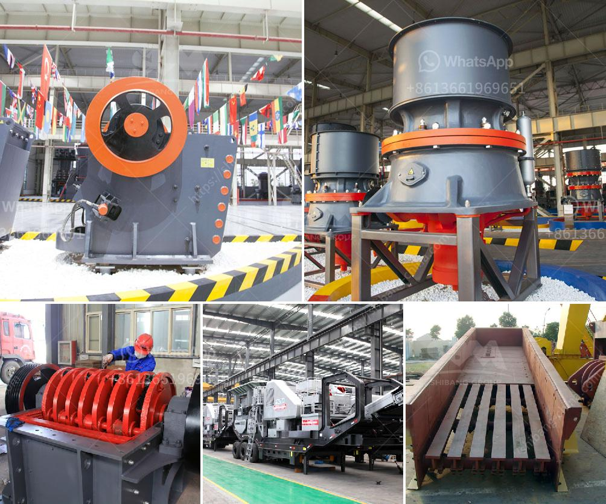

<h3>types of cone crusher</h3>
Cone crushers are a popular choice for secondary and tertiary crushing stages in many industries. Cone crushers are highly efficient and they have low operating costs. They are widely used in mining, metallurgy, building materials, road construction, chemical and other fields. There are different types of cone crushers including spring cone crusher, single cylinder hydraulic cone crusher, multi-cylinder hydraulic cone crusher and compound cone crusher.

Spring cone crusher is suitable for crushing various ores and rocks with medium hardness and above. It has the features of reliable structure, high production efficiency, convenient adjustment and economical use. The spring safety system is an overload protection device, which can make the foreign matter and iron ore go through the crushing chamber without damaging the machine. It adopts grease seal to isolate dust and lubricants, ensuring reliable operation.

Single cylinder hydraulic cone crusher is widely used in metallurgy, construction, highway, chemical industry and building materials industry. It is used for crushing medium and above hardness ores and rocks. The single cylinder hydraulic cone crusher has strong crushing ability, continuous and stable operation, neat grain shape, automatic control system, easy to replace parts, and easy maintenance.

Multi-cylinder hydraulic cone crusher is mainly used for medium and fine crushing of materials. It adopts advanced technology and has the features of large crushing force, high efficiency, low energy consumption and uniform product size. The structure of multi-cylinder hydraulic cone crusher is simple and reliable, which greatly reduces the trouble of hydraulic system.

Compound cone crusher is suitable for medium and fine crushing of various ores and rocks with hardness ≤5~16, such as iron ore, non-ferrous metal ore, granite, limestone, basalt, sandstone, pebbles, etc. Compound cone crusher has the advantages of low operating costs, large crushing ratio, high efficiency, uniform product size and good grain shape.

In conclusion, cone crushers have various types and models, each with different characteristics and applications. The selection of cone crusher should be based on the specific requirements of the project and the materials to be crushed. Whether it is spring cone crusher, single cylinder hydraulic cone crusher, multi-cylinder hydraulic cone crusher or compound cone crusher, it can meet the production needs of different customers.
<h3>Contact us</h3><ul><li><strong>Whatsapp:&nbsp;<a href="https://wa.me/8613661969651">+8613661969651</a></strong></li><li><a href="https://swt.shibang-china.com/?git&amp;zhl&amp;types of cone crusher"><strong>Online Service(chat now)</strong></a></li></ul><h3>Related</h3><ul><li><a href='price of a stone crusher.md'>price of a stone crusher</a></li><li><a href='starting of ball mill with vfd.md'>starting of ball mill with vfd</a></li><li><a href='river pebble crusher supplier.md'>river pebble crusher supplier</a></li><li><a href='compact vibrating ball mill manufactures.md'>compact vibrating ball mill manufactures</a></li><li><a href='mobile glass crushing plant.md'>mobile glass crushing plant</a></li></ul>