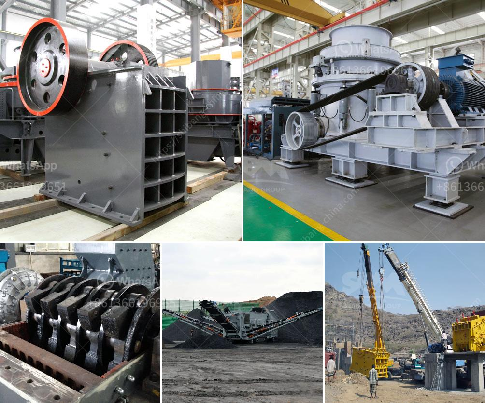

<h3>types of grinding mill</h3>
Grinding mills are machinery that is primarily used to reduce the size of various materials and self-contained unit operations. They are mostly used in the mining industry, construction industry, and chemical industry. The purpose of grinding mills is to break down large pieces of material into smaller pieces, making them suitable for further processing. With a wide range of grinding mills available in the market, it is essential to understand the different types and their applications. In this article, we will explore some of the most common types of grinding mills.

1. Ball Mill: This is a cylindrical machine made of steel that pulverizes materials by utilizing a series of grinding balls. It is commonly used for grinding and blending materials for use in mineral dressing processes, paints, pyrotechnics, ceramics, and selective laser sintering. The ball mill works on the principle of impact and attrition, where the grinding media (balls) impact the material to be ground, reducing its size.

2. Vertical Roller Mill: Also known as VRM, this mill uses rollers instead of balls to crush materials. It has a larger grinding surface area and is more efficient in grinding finer particles. Vertical roller mills are commonly used in the cement industry for grinding raw materials, coal, and cement clinker.

3. Raymond Mill: Developed by Raymond brothers in the 19th century, Raymond mill is a widely used grinding mill that can grind materials into fine powder. It is also known as the suspension roller mill. This mill features a high-pressure spring inside the grinding device to increase the grinding force, making it suitable for processing various materials, including limestone, gypsum, coal, and many others.

4. Hammer Mill: This mill consists of a rotating shaft with hammers attached to it. The hammers strike and shatter the material, causing it to break down. Hammer mills are widely used in the agricultural sector to mill grains, as well as in the pharmaceutical and food processing industries.

5. Autogenous Mill: Autogenous mills are designed for grinding or pulverizing rom ore (run-of-mine) into smaller fragments. They use the ore itself as grinding media, rather than using steel balls or rods. Autogenous mills are commonly used in the mining industry for processing ores, such as gold, copper, and iron.

6. Vibrating Mill: This mill utilizes a vibrating motion to cause collisions between materials and grinding media. Vibrating mills are used for very fine grinding, particularly in the pharmaceutical and chemical industries.

7. Air Jet Mill: This type of mill uses high-pressure air or gas to cause particle-on-particle impact to grind materials. It is especially effective for grinding heat-sensitive or friable materials.

In conclusion, grinding mills play a crucial role in various industries by reducing the size of materials for further processing. Each type of grinding mill has its unique features and applications. The selection of the appropriate grinding mill depends on the material to be ground, desired particle size, and other factors. With a better understanding of the different types available, industries and individuals can choose the most suitable grinding mill for their specific needs.
<h3>Contact us</h3><ul><li><strong>Whatsapp:&nbsp;<a href="https://wa.me/8613661969651">+8613661969651</a></strong></li><li><a href="https://swt.shibang-china.com/?git&amp;zhl&amp;types of grinding mill"><strong>Online Service(chat now)</strong></a></li></ul><h3>Related</h3><ul><li><a href='mill ball grinding ball mills.md'>mill ball grinding ball mills</a></li><li><a href='jaw crusher equipment supplier.md'>jaw crusher equipment supplier</a></li><li><a href='iron ore pelletisation plant china.md'>iron ore pelletisation plant china</a></li><li><a href='iron ore crushing process.md'>iron ore crushing process</a></li><li><a href='china clay washing equipment sale supplier.md'>china clay washing equipment sale supplier</a></li></ul>