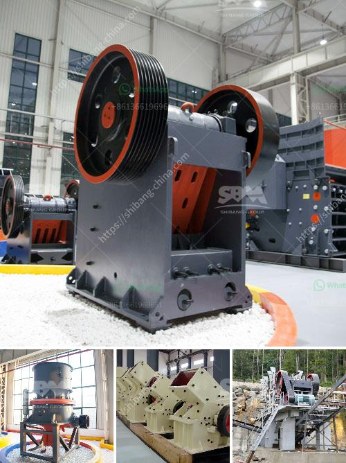

<h3>types of stone crusher machine list</h3>
Crusher plays an important role in the stone processing line. And with the development of mining machinery, the type of stone crusher machine becomes more and more rich, such as jaw crusher, impact crusher, and cone crusher. All of them have their own advantages.

Jaw crusher is mainly used for coarse crushing and medium crushing in the departments of mining, building materials and infrastructure construction. According to the feeding width, it can be divided into large, medium and small sized. The jaw crushers have many advantages such as simple structure, easy manufacturing, reliable working condition and convenient operation and maintenance.

Impact crusher is suitable for materials whose compressive strength is under 350Mpa, and particle size is less than 500mm. With end products in cubic shape, the impact crusher is widely used for sand and rock producing in the industry of roads, railways, reservoir, electricity power and building materials and so on.

Cone crusher is mainly used for the secondary and tertiary crushing in mine and construction aggregates production industry. It is also suitable for medium and fine crushing of rocks with below 350 MPa compressive strength,

With the development of technology and mineral beneficiation process, the so-called cone crusher cavity, that is space for the ore blocks to pass, must be differentiated, from each other. As a result, it can be divided into four cavity types. The crushing cavity types of cone crusher include:

In addition, each type of crusher has different models and specifications, which can be matched with different production line configurations. And the prices of them are also different, so customers should choose the right equipment according to their actual situation.

Furthermore, some stone crusher manufacturers ensure that the size of the crushed ore particles is uniform, which is beneficial to the next process. However, many users consider that the granularity of finished products is not a factor related to the model of crusher machine.

To sum up, choosing the right stone crusher machine is important in order to get the most efficient and effective production line. Different models of stone crushers have different prices. Therefore, while purchasing a stone crusher machine, you should have a clear understanding of your requirements and choose a suitable model according to your needs.

In conclusion, the above mentioned formats are the different types of stone crusher machines with their features, specifications and applications. So, without further ado, let me jump into the main theme now.
<h3>Contact us</h3><ul><li><strong>Whatsapp:&nbsp;<a href="https://wa.me/8613661969651">+8613661969651</a></strong></li><li><a href="https://swt.shibang-china.com/?git&amp;zhl&amp;types of stone crusher machine list"><strong>Online Service(chat now)</strong></a></li></ul><h3>Related</h3><ul><li><a href='granite edge cutting machine in sweden.md'>granite edge cutting machine in sweden</a></li><li><a href='silica sand washing and grinding.md'>silica sand washing and grinding</a></li><li><a href='crusher machine manufacturer in coimbatore.md'>crusher machine manufacturer in coimbatore</a></li><li><a href='services of a crushing machine.md'>services of a crushing machine</a></li><li><a href='stone crusher price in south africa.md'>stone crusher price in south africa</a></li></ul>