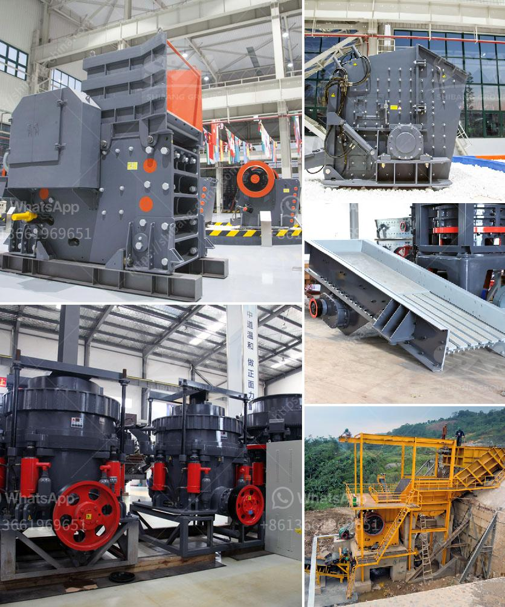

<h3>ultra conveyor belts usa</h3>
The conveyor belt industry plays a crucial role in today's modern manufacturing and distribution systems. These belts facilitate the movement of goods and materials in a variety of industries, ranging from mining and agriculture to food processing and logistics. As this industry continues to evolve, Ultra Conveyor Belts USA stands out as a leading innovator and provider of state-of-the-art conveyor belt solutions in the United States.

With over a decade of experience, Ultra Conveyor Belts USA has established itself as a reliable and trusted partner for businesses across various sectors. The company specializes in the design, manufacturing, and installation of high-quality conveyor belts that are built to withstand the toughest working conditions while maximizing efficiency and safety.

One of the key aspects that sets Ultra Conveyor Belts USA apart is its commitment to innovation. The company incorporates cutting-edge technology and advanced materials in its conveyor belt systems. By staying ahead of the curve, they are able to offer customers a competitive edge, enhancing productivity, and reducing downtime.

Ultra Conveyor Belts USA understands that no two businesses or industries are the same. That's why they provide customized conveyor belt solutions tailored to meet the specific needs and requirements of each customer. Whether it's an underground mining operation or a food processing plant, their team of experts works closely with clients to develop the most efficient and reliable conveyor belt system for their operations.

Safety is a top priority for Ultra Conveyor Belts USA. They invest heavily in developing safety features and incorporating the latest industry standards into their products. From state-of-the-art sensor technology that detects potential hazards to emergency stop buttons strategically placed along the conveyor belt, their systems are designed to protect both workers and the integrity of the materials being transported.

Additionally, Ultra Conveyor Belts USA offers comprehensive maintenance and servicing programs to ensure that their conveyor belt systems operate at peak performance levels throughout their lifespan. Regular inspections and maintenance help identify and address any potential issues before they become major problems, minimizing downtime and maximizing productivity.

In an era of increasing environmental awareness, Ultra Conveyor Belts USA is also committed to sustainability. They invest in research and development to create eco-friendly conveyor belt systems that reduce energy consumption and minimize waste. By utilizing efficient materials and designing belts with longevity in mind, the company helps its clients achieve their sustainability goals while reducing operational costs.

As an industry leader in the United States, Ultra Conveyor Belts USA has built a strong reputation for delivering exceptional quality, reliability, and innovation. Their commitment to customer satisfaction and continuous improvement has earned them the trust and loyalty of businesses across the nation.

In conclusion, Ultra Conveyor Belts USA is revolutionizing the conveyor belt industry with its state-of-the-art solutions, customized designs, focus on safety, and commitment to sustainability. By partnering with this innovative company, businesses across various sectors can streamline their operations, improve efficiency, and ensure the smooth movement of goods and materials. Ultra Conveyor Belts USA is paving the way for a more efficient and sustainable future in the conveyor belt industry.
<h3>Contact us</h3><ul><li><strong>Whatsapp:&nbsp;<a href="https://wa.me/8613661969651">+8613661969651</a></strong></li><li><a href="https://swt.shibang-china.com/?git&amp;zhl&amp;ultra conveyor belts usa"><strong>Online Service(chat now)</strong></a></li></ul><h3>Related</h3><ul><li><a href='stone crusher price in south africa.md'>stone crusher price in south africa</a></li><li><a href='cone crusher hp 300.md'>cone crusher hp 300</a></li><li><a href='small scale gold refinery plant equipments.md'>small scale gold refinery plant equipments</a></li><li><a href='rock crusher design.md'>rock crusher design</a></li><li><a href='concrete crushers for recycling.md'>concrete crushers for recycling</a></li></ul>