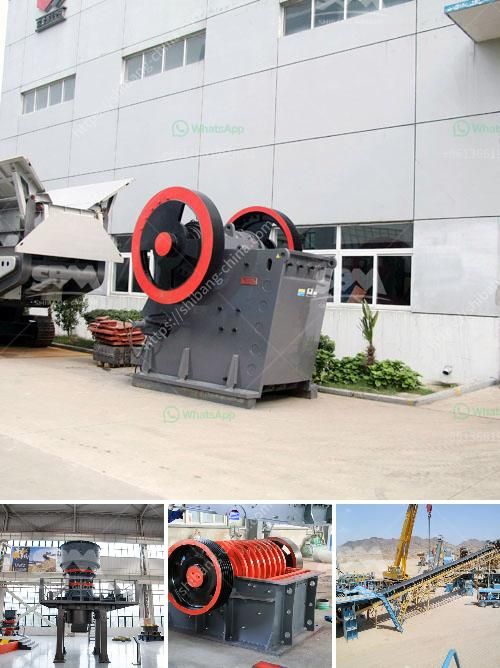

<h3>ultra fine grinder mill</h3>
Ultra fine grinder mill, also known as ultra fine grinding mill, is a kind of grinding equipment developed for processing fine and ultrafine powder. It has outstanding advantages in grinding efficiency, energy consumption and environmental protection.

Ultra fine grinder mill is mainly used for grinding 500 mesh powder, and can be adjusted to 2500 mesh in the case of grinding fine powders. With the development of industry, the market value of ultra-fine powder has been improved. In order to meet the market demand, ultra fine grinder mill has become the mainstream equipment for processing ultrafine powder.

The ultra fine grinder mill adopts the advanced design concept of "decreasing the gear speed and increasing the grinding force". It improves the fineness and production capacity by reducing the power consumption, increasing the grinding speed, and adding an appropriate amount of grinding aid.

Compared with traditional Raymond mill, ball mill and other equipment, the ultra fine grinder mill has the advantages of high grinding efficiency, low energy consumption, high production capacity, convenient maintenance, low noise and environmental protection. The whole system is sealed and operates under negative pressure, which effectively prevents dust spillover, making the working environment cleaner.

In addition, the ultra fine grinder mill has unique advantages in terms of material selection, wear resistance and product fineness. The main components such as grinding roller, grinding ring and bearing are made of high-quality materials, which greatly improve the wear resistance of the equipment and prolong its service life.

In summary, ultra fine grinder mill is the ideal equipment for processing fine and ultrafine powder. With its excellent performance and advantages, it has won the favor and recognition of customers. As a leading manufacturer in the industry, we are committed to providing customers with high-quality ultra fine grinder mill and comprehensive after-sales service.
<h3>Contact us</h3><ul><li><strong>Whatsapp:&nbsp;<a href="https://wa.me/8613661969651">+8613661969651</a></strong></li><li><a href="https://swt.shibang-china.com/?git&amp;zhl&amp;ultra fine grinder mill"><strong>Online Service(chat now)</strong></a></li></ul><h3>Related</h3><ul><li><a href='ball mill pulverizer.md'>ball mill pulverizer</a></li><li><a href='calcite processing plant.md'>calcite processing plant</a></li><li><a href='malaysia conveyor belts price.md'>malaysia conveyor belts price</a></li><li><a href='caco grinding grinder.md'>caco grinding grinder</a></li><li><a href='diesel compressors for sale in south africa.md'>diesel compressors for sale in south africa</a></li></ul>