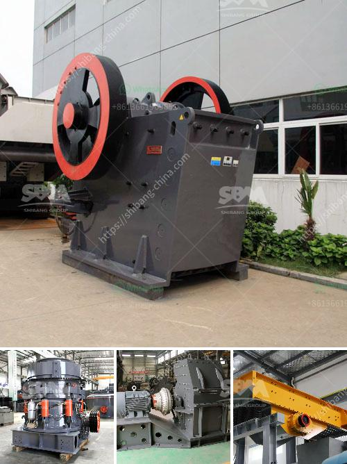

<h3>ultra fine grinding mill for limestone</h3>
Ultra fine grinding mill for limestone, also known as Raymond mill, is widely used in the grinding process of limestone. The machine has a series of advantages, such as high efficiency, low energy consumption, small floor space, less investment, and less capital construction cost. It is widely used in the mining industry, metallurgical industry, chemical industry, and other fields.

Limestone is an important raw material in construction, agriculture, and other industries. It can be used to produce cement, lime, calcium carbide, and other industrial products. It is also an indispensable flux limestone in the metallurgical industry. With the increasing demand for limestone powder, ultra-fine grinding mill for limestone is needed to produce fine limestone powder.

The ultra-fine grinding mill can meet the requirement of fineness from 300 mesh to 2500 mesh. The ultra-fine grinding mill is suitable for grinding the pulverized coal, coke powder, limestone, and other non-metallic powder with high efficiency. The grinding mill is more efficient than ball mill which can grind limestone into fine powder quickly and without pollution.

The ultra-fine grinding mill not only has high fineness, but also has high output. Low noise, easy operation, and low maintenance cost are the characteristic features of the ultra-fine grinding mill. In addition, the ultra-fine grinding mill is environmentally friendly and meets the environmental protection standards. Therefore, it is favored by many users.

In conclusion, the ultra-fine grinding mill for limestone has many advantages. It can process limestone powder with a wide range of fineness, which can be adjusted according to the actual needs of customers. The ultra-fine grinding mill is the best choice for many industries to grind limestone into fine powder.
<h3>Contact us</h3><ul><li><strong>Whatsapp:&nbsp;<a href="https://wa.me/8613661969651">+8613661969651</a></strong></li><li><a href="https://swt.shibang-china.com/?git&amp;zhl&amp;ultra fine grinding mill for limestone"><strong>Online Service(chat now)</strong></a></li></ul><h3>Related</h3><ul><li><a href='grinder mill china.md'>grinder mill china</a></li><li><a href='suppliers of chromite sand from south africa.md'>suppliers of chromite sand from south africa</a></li><li><a href='impact crusher specification limestone.md'>impact crusher specification limestone</a></li><li><a href='harga mesin ball mill.md'>harga mesin ball mill</a></li><li><a href='ball mill capacity.md'>ball mill capacity</a></li></ul>