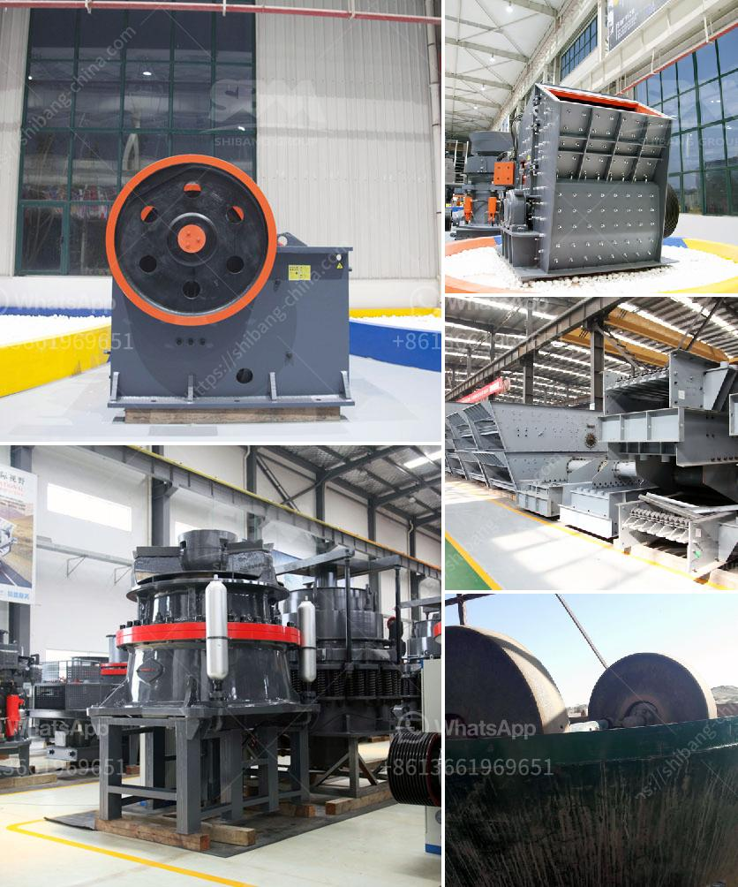

<h3>ultrafine grinder mill construction</h3>
Ultrafine grinder mill, also known as ultrafine grinding mill, is a kind of grinding machine widely used in mining, cement, construction, and other industries. It is used to process bulk materials into fine powder, making them ideal for use in various industries. With the continuous development of technology, the construction of ultrafine grinder mill has become more advanced and efficient, allowing for higher productivity and finer grinding results.

The construction of an ultrafine grinder mill starts with the base frame, which supports all the other components of the mill. It is usually made of high-quality steel and designed to withstand heavy loads and vibrations during operation. The base frame is also equipped with adjustable feet, which allows for easy leveling of the mill on uneven surfaces.

The grinding chamber is another important component of an ultrafine grinder mill. It is usually lined with wear-resistant materials, such as high-quality alloy steel, to protect it from the abrasive nature of the materials being processed. The interior of the grinding chamber is designed in such a way that it allows for efficient circulation of the grinding media, ensuring uniform grinding and preventing clogging.

The rotor is the main rotating component of the ultrafine grinder mill. It consists of a shaft, a series of discs or hammers, and grinding pins. The rotor is driven by a powerful motor, which provides the necessary force for grinding the materials. The rotor’s high-speed rotation creates a centrifugal force, which throws the grinding media against the materials, resulting in fine grinding.

To control the size of the final product, an ultrafine grinder mill is equipped with a classifier. The classifier separates the fine particles from the coarse particles, allowing for precise control over the particle size distribution. This is essential for industries that require a certain level of fineness in their products, such as pharmaceuticals and pigments.

To ensure the safety of the operator and the integrity of the mill, various safety mechanisms are incorporated into the construction of an ultrafine grinder mill. These include interlocks and sensors that prevent the mill from operating when the access doors are open or when there is an abnormal condition, such as overheating or excessive vibration. Additionally, the mill is usually equipped with a dust collection system to minimize the release of fine particles into the air, ensuring a clean and safe working environment.

In conclusion, the construction of an ultrafine grinder mill involves several key components, such as the base frame, grinding chamber, rotor, and classifier. These components work together to efficiently process bulk materials into fine powder. With continuous advancements in technology, the construction of ultrafine grinder mills has become more advanced, allowing for higher productivity, better grinding results, and increased safety.
<h3>Contact us</h3><ul><li><strong>Whatsapp:&nbsp;<a href="https://wa.me/8613661969651">+8613661969651</a></strong></li><li><a href="https://swt.shibang-china.com/?git&amp;zhl&amp;ultrafine grinder mill construction"><strong>Online Service(chat now)</strong></a></li></ul><h3>Related</h3><ul><li><a href='industrial hammer mill.md'>industrial hammer mill</a></li><li><a href='sand mining for construction in equatorial guinea.md'>sand mining for construction in equatorial guinea</a></li><li><a href='price of conveyor belt.md'>price of conveyor belt</a></li><li><a href='qustion about ball milling process.md'>qustion about ball milling process</a></li><li><a href='belt conveyor for sale china.md'>belt conveyor for sale china</a></li></ul>