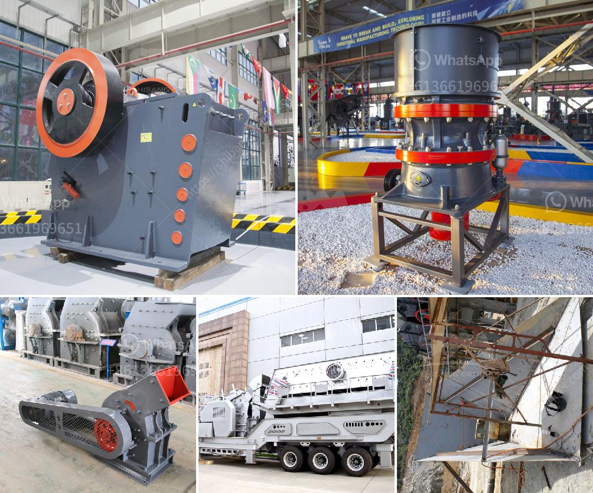

<h3>ultrafine powder mill</h3>
In today's rapidly evolving industries, the demand for high-quality powders has increased significantly. Whether it's for cosmetics, pharmaceuticals, or advanced manufacturing processes, achieving ultrafine powders is crucial. This is where the ultrafine powder mill comes into play, revolutionizing the grinding industry with its exceptional capabilities.

An ultrafine powder mill is a state-of-the-art machine specially designed for grinding and pulverizing various materials into ultrafine powders. Unlike traditional grinding mills that produce coarse powders, this advanced mill ensures the production of fine and ultrafine particles.

One of the notable advantages of an ultrafine powder mill is its ability to reduce the particle size to an extraordinary level. With its precision grinding mechanism, it can grind materials into powders as low as a few microns. This level of fineness opens up new possibilities for industries that require exceptional quality and performance.

Additionally, the ultrafine powder mill is equipped with advanced technologies to ensure efficient and high-speed grinding operations. It utilizes a combination of air, impact, and shear forces to achieve ultrafine particle size reduction while maintaining low energy consumption. This results in enhanced productivity and cost-efficiency for businesses.

Furthermore, the ultrafine powder mill offers versatility by accommodating various materials, such as minerals, chemicals, ceramics, and more. Its adaptable design allows for easy adjustments in grinding parameters, making it suitable for a wide range of applications. Whether it's grinding, sieving, or classifying, this mill has become an indispensable tool for many industries.

In conclusion, the advent of the ultrafine powder mill has revolutionized the grinding industry. Its ability to produce ultrafine powders with exceptional precision and speed has transformed manufacturing processes across various sectors. As technology continues to advance, we can expect further enhancements in ultrafine powder milling, catering to the ever-growing demands for top-notch powders in the global market.
<h3>Contact us</h3><ul><li><strong>Whatsapp:&nbsp;<a href="https://wa.me/8613661969651">+8613661969651</a></strong></li><li><a href="https://swt.shibang-china.com/?git&amp;zhl&amp;ultrafine powder mill"><strong>Online Service(chat now)</strong></a></li></ul><h3>Related</h3><ul><li><a href='price of portable stonecrusher.md'>price of portable stonecrusher</a></li><li><a href='gravel making crusher.md'>gravel making crusher</a></li><li><a href='high capacity stone hammer crusher manufacturer.md'>high capacity stone hammer crusher manufacturer</a></li><li><a href='gold mining equipment for sale in singapore.md'>gold mining equipment for sale in singapore</a></li><li><a href='marble crushing equipment.md'>marble crushing equipment</a></li></ul>