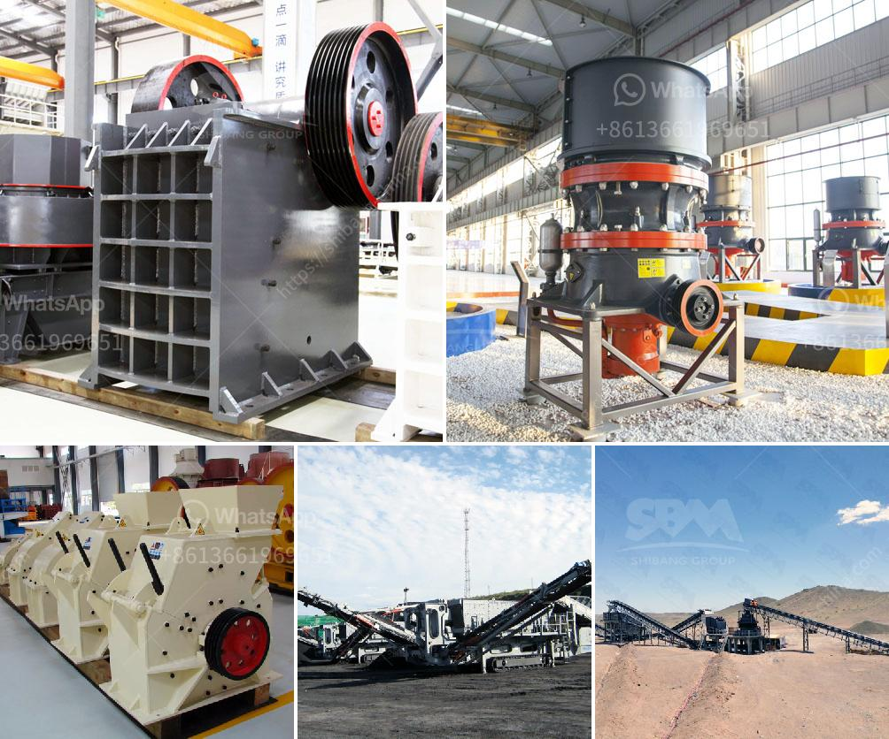

<h3>use of talc in fertilizer coating process</h3>
Talc is a naturally occurring mineral that has long been used in various industries, including agriculture. It has proven to be beneficial in the fertilizer coating process due to its unique properties and characteristics.

One of the primary uses of talc in fertilizer coating is to improve the flowability and handling of the fertilizer particles. Talc acts as a lubricant, reducing friction between particles and preventing them from clumping together. This ensures a smooth and even distribution of coated fertilizer, facilitating efficient application and preventing clogging in the spreading equipment.

Additionally, talc serves as a carrier for various additives and micronutrients in the fertilizer coating process. By mixing talc with these additives, such as pesticides or slow-release agents, they can be evenly dispersed and coated onto the fertilizer particles. This enhances the efficacy of these substances by providing controlled release and protecting them from degradation and loss due to environmental factors.

Furthermore, talc improves the visual appearance of coated fertilizers. It gives a smooth and uniform texture to the particles, making them more visually appealing and marketable. This can be particularly advantageous for specialty fertilizers or those intended for consumer use, where aesthetics play a significant role in consumer preference.

Talc also offers benefits in terms of moisture absorption and retention. It can help to prevent moisture-induced caking or agglomeration of fertilizer particles during storage or transportation. Additionally, talc has the ability to absorb excess moisture from the surrounding environment, thereby maintaining the quality and integrity of the coated fertilizer.

In conclusion, the use of talc in the fertilizer coating process provides several advantages. From enhancing flowability and handling to acting as a carrier for various additives, talc improves the overall performance and appearance of coated fertilizers. Its ability to absorb and retain moisture further contributes to the quality and longevity of these products. With its unique properties, talc continues to be a valuable ingredient in the world of fertilizer production.
<h3>Contact us</h3><ul><li><strong>Whatsapp:&nbsp;<a href="https://wa.me/8613661969651">+8613661969651</a></strong></li><li><a href="https://swt.shibang-china.com/?git&amp;zhl&amp;use of talc in fertilizer coating process"><strong>Online Service(chat now)</strong></a></li></ul><h3>Related</h3><ul><li><a href='marble grinding mill process.md'>marble grinding mill process</a></li><li><a href='used quarry crusher machine germany.md'>used quarry crusher machine germany</a></li><li><a href='calcite grinding process.md'>calcite grinding process</a></li><li><a href='operating costs for a stone crusher plant.md'>operating costs for a stone crusher plant</a></li><li><a href='mobile crusher  china.md'>mobile crusher - china</a></li></ul>