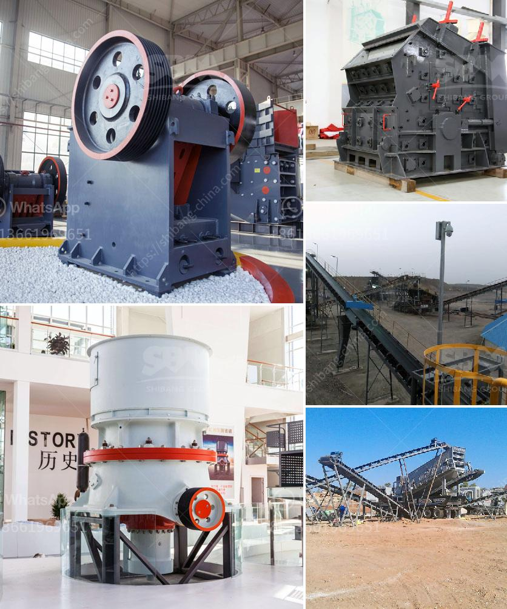

<h3>used 34 ssi shredder united states</h3>
In an era of heightened environmental consciousness, the need for efficient waste management solutions has never been more crucial. One innovative solution making waves in the recycling industry is the 34 SSI shredder. Highly regarded for its versatility and reliability, this shredding machine has transformed the landscape of recycling in the United States. In this article, we delve into the various applications, features, and benefits of the 34 SSI shredder.

The 34 SSI shredder is a powerful machinery that finds application in a wide range of recycling processes. Its primary function is to shred large volumes of paper, plastic, wood, and metal waste into smaller pieces for downstream recycling. From industrial operations to municipal waste management facilities, this shredder has proved indispensable in enhancing the efficiency and effectiveness of recycling processes across the United States.

Designed and manufactured by SSI Shredding Systems, a globally recognized leader in the waste management industry, the 34 SSI shredder boasts numerous notable features. Equipped with heavy-duty cutting teeth and durable blades, it effortlessly processes a wide variety of materials, including cardboard, tires, e-waste, and more. Its robust structure and advanced technology ensure consistent performance, even when handling dense and challenging materials.

The versatility of the 34 SSI shredder also shines through its customizable settings. Operators can adjust the machine to achieve different shred sizes depending on the specific recycling requirements. This increased flexibility enables industries to cater to a wide range of raw materials and produce desired output for resale or further processing.

1. Increased Efficiency: With a processing capacity of up to 10 tons per hour, the 34 SSI shredder significantly boosts operational efficiency. Its high-performance design ensures swift and seamless shredding, reducing downtime and increasing productivity.

2. Enhanced Safety: Equipped with advanced safety mechanisms, the 34 SSI shredder operates with minimal risk. Features such as emergency stop functions, safety locks, and automatic overload protection systems prioritize operator safety, reducing the likelihood of accidents.

3. Cost-Effective: Investing in the 34 SSI shredder translates to long-term cost savings. By streamlining recycling processes and enabling the creation of high-quality recycled materials, organizations can reduce waste disposal expenses and generate additional revenue through the sale of value-added end-products.

4. Positive Environmental Impact: Efficient and effective waste management is crucial for preserving and protecting the environment. The 34 SSI shredder plays a crucial role in minimizing waste volume, facilitating recycling initiatives, and promoting a circular economy.

The 34 SSI shredder stands as a game-changer in the American recycling sector, revolutionizing waste management practices with its exceptional versatility, robust functionality, and tangible benefits. From increased operational efficiency to minimized waste disposal costs, this shredder exemplifies the heights of innovation in waste management technology. As industries continually strive to reduce their ecological footprint, the 34 SSI shredder has undoubtedly emerged as a powerful ally in achieving and sustaining a more sustainable future.
<h3>Contact us</h3><ul><li><strong>Whatsapp:&nbsp;<a href="https://wa.me/8613661969651">+8613661969651</a></strong></li><li><a href="https://swt.shibang-china.com/?git&amp;zhl&amp;used 34 ssi shredder united states"><strong>Online Service(chat now)</strong></a></li></ul><h3>Related</h3><ul><li><a href='mobile crushers for sale ghana.md'>mobile crushers for sale ghana</a></li><li><a href='jaw crusher project report pdf.md'>jaw crusher project report pdf</a></li><li><a href='potassium ore production equipment.md'>potassium ore production equipment</a></li><li><a href='ball mill unloading system in india.md'>ball mill unloading system in india</a></li><li><a href='crusher in the philippines.md'>crusher in the philippines</a></li></ul>