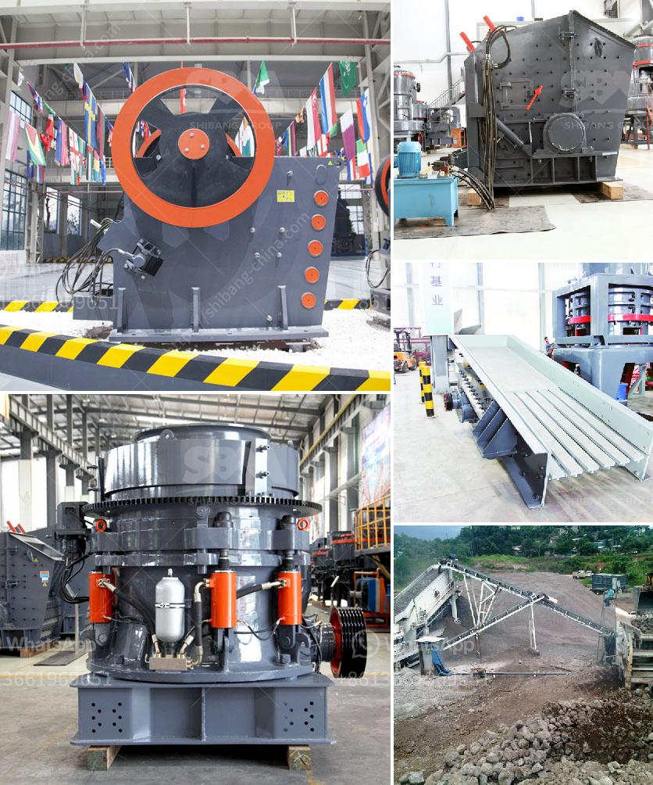

<h3>used 500 tph stone crusher prices</h3>
When it comes to purchasing a stone crusher, we start up a little earlier to study and research, and we look around and observe the market situation. Finally, we decided to purchase a used 500 tph stone crusher for its large-scale production capacity. This decision was made after carefully considering the economics and practicality of the situation.

The first thing we need to consider when purchasing a used stone crusher is its price. Generally, the price of a used machine is lower than that of a new one. However, when purchasing a used 500 tph stone crusher, you need to be cautious. The price may vary depending on the specific condition of the machine, its age, and the supplier you choose to buy from.

In order to make an informed decision, it is necessary to consider several factors. Firstly, you should determine the specific features and requirements of the stone crusher. This includes the capacity, power, and size of the machine. A 500 tph stone crusher is ideal for large-scale production, but it may not meet the requirements of every customer.

Secondly, you should consider the condition of the used stone crusher. Check for any damages or wear and tear that might affect its performance. It is advisable to inspect the machine before making a purchase, or hire a professional to carry out the inspection. This will help you identify any potential issues and estimate the cost of repairs or maintenance.

Furthermore, it is crucial to research and compare prices from different suppliers. Look for reliable and reputable sellers who offer competitive prices. Don't be afraid to negotiate and ask for discounts. Make sure to get a detailed quote that includes any additional costs such as shipping or taxes.

Lastly, you need to consider the after-sales service and support offered by the supplier. A used stone crusher may require regular maintenance and repairs. Therefore, it is important to choose a supplier who can provide spare parts and technical assistance. This will ensure the smooth operation of the machine and minimize downtime.

In conclusion, purchasing a used 500 tph stone crusher requires careful consideration of various factors. Price is important, but it should not be the sole determining factor. Consider the specific requirements, condition, and reputation of the supplier before making a decision. Conduct thorough research, inspect the machine, and compare prices to ensure a wise investment. By following these guidelines, you can find a high-quality used stone crusher at a reasonable price.
<h3>Contact us</h3><ul><li><strong>Whatsapp:&nbsp;<a href="https://wa.me/8613661969651">+8613661969651</a></strong></li><li><a href="https://swt.shibang-china.com/?git&amp;zhl&amp;used 500 tph stone crusher prices"><strong>Online Service(chat now)</strong></a></li></ul><h3>Related</h3><ul><li><a href='stone crusher machine in saudi arabia.md'>stone crusher machine in saudi arabia</a></li><li><a href='manufacture of conveyor belts in bogota.md'>manufacture of conveyor belts in bogota</a></li><li><a href='200tph crushing system in south africa.md'>200tph crushing system in south africa</a></li><li><a href='coal mill grinding rolls.md'>coal mill grinding rolls</a></li><li><a href='quarry business plan sample.md'>quarry business plan sample</a></li></ul>