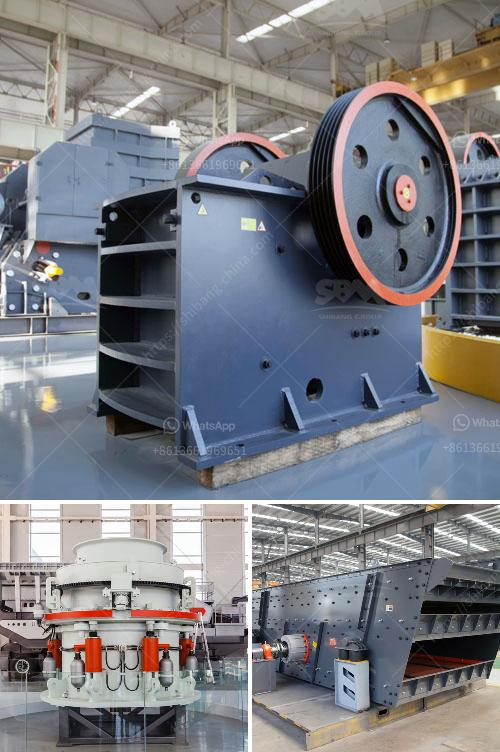

<h3>used ball mills for sale</h3>
When it comes to grinding and milling, the ball mill is undoubtedly one of the most popular and versatile milling equipments utilized across numerous industries. A ball mill comprises a rotating cylindrical chamber that is partially filled with a grinding medium, such as metallic balls, and is used to grind material into a fine powder. The ball mill can be used for both wet and dry grinding, making it a versatile choice for a wide range of applications.

Purchasing a new ball mill can be expensive, especially for smaller businesses or laboratories that may have limited budgets. That's where used ball mills come in. With a well-maintained used ball mill, you can reduce your investment cost while still receiving a high-quality product for your grinding needs. Let's explore the benefits of purchasing used ball mills.

Cost-Effective: One of the primary benefits of buying a used ball mill is the significant reduction in cost. Used ball mills are typically sold at a fraction of the cost of new mills, which means that you can save money on your purchase and still get a reliable machine that meets your grinding requirements.

Immediate Availability: Another advantage of opting for used ball mills is that they are readily available. Unlike new mills, which may require a waiting period for delivery or manufacturing, used ball mills can be sourced quickly and easily from reliable suppliers. This means that you can have your grinding equipment up and running in no time, minimizing any production delays.

Reliable Performance: Reputable suppliers of used ball mills thoroughly inspect and refurbish the machines before putting them on sale. They ensure that the used mills are in proper working condition and meet the necessary technical specifications. By purchasing from a reputable supplier, you can be assured of a reliable machine that delivers consistent performance.

Versatile Applications: Used ball mills can be employed for a wide range of grinding and milling applications. They are commonly used in cement manufacturing, mining, power generation, chemical processing, and pharmaceutical industries, among others. Whether you need to grind down raw materials or pulverize a material into a fine powder, a used ball mill can effectively meet your needs.

Customizable Design: Used ball mills often come with a standardized design, allowing for easy integration into your existing production setup. However, if necessary, the equipment can be modified or customized to fit your specific requirements. This flexibility allows you to optimize your milling process for improved efficiency and productivity.

In conclusion, purchasing used ball mills is a cost-effective and practical solution for businesses or laboratories looking to acquire efficient grinding equipment. With the immediate availability and reliable performance, used ball mills offer a valuable alternative to investing in new machinery. So, whether you're a small business owner or a researcher, consider exploring the market for used ball mills to find the perfect solution for your grinding needs.
<h3>Contact us</h3><ul><li><strong>Whatsapp:&nbsp;<a href="https://wa.me/8613661969651">+8613661969651</a></strong></li><li><a href="https://swt.shibang-china.com/?git&amp;zhl&amp;used ball mills for sale"><strong>Online Service(chat now)</strong></a></li></ul><h3>Related</h3><ul><li><a href='jaw crushing plant cost.md'>jaw crushing plant cost</a></li><li><a href='vertical ball mills of india.md'>vertical ball mills of india</a></li><li><a href='small rock crusher portable gold mining.md'>small rock crusher portable gold mining</a></li><li><a href='balls for mining mill.md'>balls for mining mill</a></li><li><a href='ball mill pakistan for sale.md'>ball mill pakistan for sale</a></li></ul>