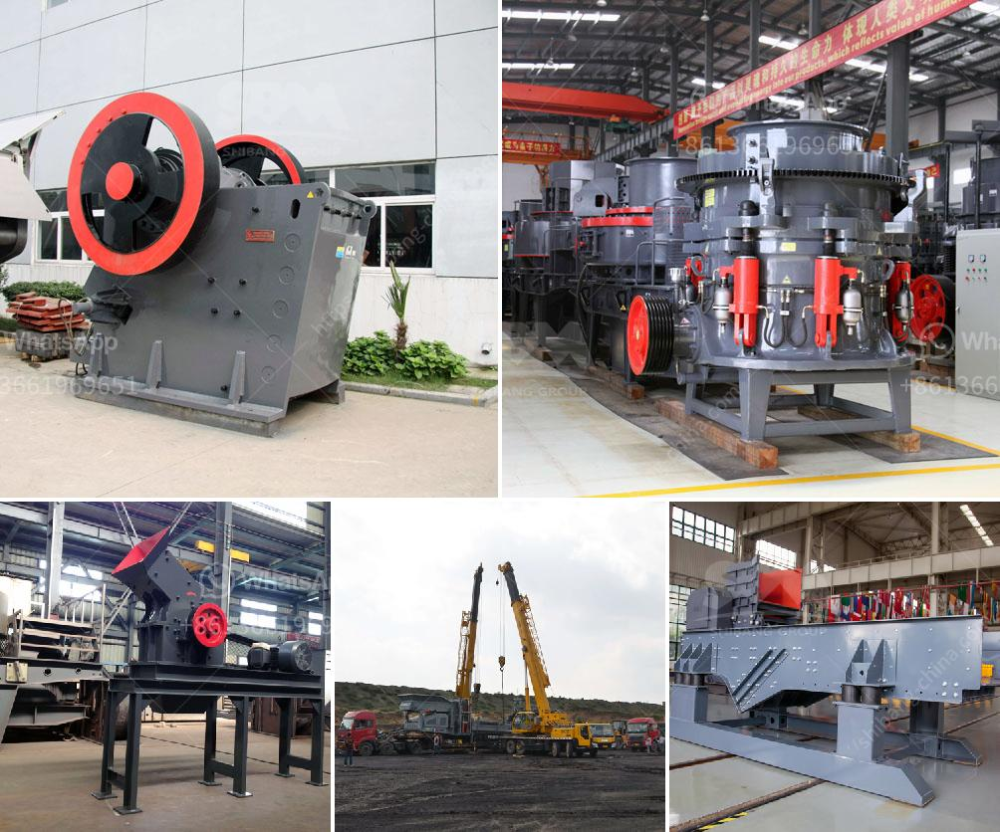

<h3>used big mobile jaw crusher in dubai</h3>
Used big mobile jaw crusher in Dubai is in excellent condition and ready to work. The  machine could even be incorporated into a mobile crushing plant, allowing businesses to save on transportation costs. These crushers are also ideal for recycling concrete and other waste materials, reducing the amount of waste dumped in landfills. Additionally, the jaw crusher’s excellent performance allows for a high reduction ratio, meaning more material can be processed over a shorter period of time.

It’s important to consider the type and size of materials the crusher will be used for, as different crushers are designed for specific purposes. A big mobile jaw crusher is perfect for crushing larger rock and concrete materials, making it ideal for construction sites and quarries. If you are looking for a machine that can crush tough materials, this is the ideal choice.

When purchasing a used crusher, there are a few factors to consider. First, inspect the crusher to ensure it is in good condition with all parts intact. Next, check the motor and make sure it is running smoothly. It’s also important to assess how frequently the crusher was used and for what purpose. Regular maintenance and repair records are helpful to determine the overall condition and lifespan of the machine.

Dubai, being a hub for construction and development, makes it an ideal location to purchase used machinery. With countless construction projects underway, there is always a demand for reliable crushers. Additionally, the high-quality infrastructure and support services available in Dubai make it easy to transport and maintain these machines.

If you are in the market for a used big mobile jaw crusher in Dubai, it’s essential to do your research and choose a reputable seller. Look for a seller with a proven track record and positive customer reviews. Additionally, ask for any warranties or guarantees that may come with the purchase.

In conclusion, a used big mobile jaw crusher in Dubai can be a great investment if you are in need of a machine that can crush tough materials efficiently. By purchasing a used crusher, you can save significant amounts of money while still ensuring the machine is in excellent condition and ready to work.
<h3>Contact us</h3><ul><li><strong>Whatsapp:&nbsp;<a href="https://wa.me/8613661969651">+8613661969651</a></strong></li><li><a href="https://swt.shibang-china.com/?git&amp;zhl&amp;used big mobile jaw crusher in dubai"><strong>Online Service(chat now)</strong></a></li></ul><h3>Related</h3><ul><li><a href='potential of mica wet grinding plant.md'>potential of mica wet grinding plant</a></li><li><a href='calcium ball mill.md'>calcium ball mill</a></li><li><a href='vertical ball mills of india.md'>vertical ball mills of india</a></li><li><a href='vibrating screen for mesh 14 vibrating screen.md'>vibrating screen for mesh 14 vibrating screen</a></li><li><a href='two roll mill supply in sri lanka.md'>two roll mill supply in sri lanka</a></li></ul>