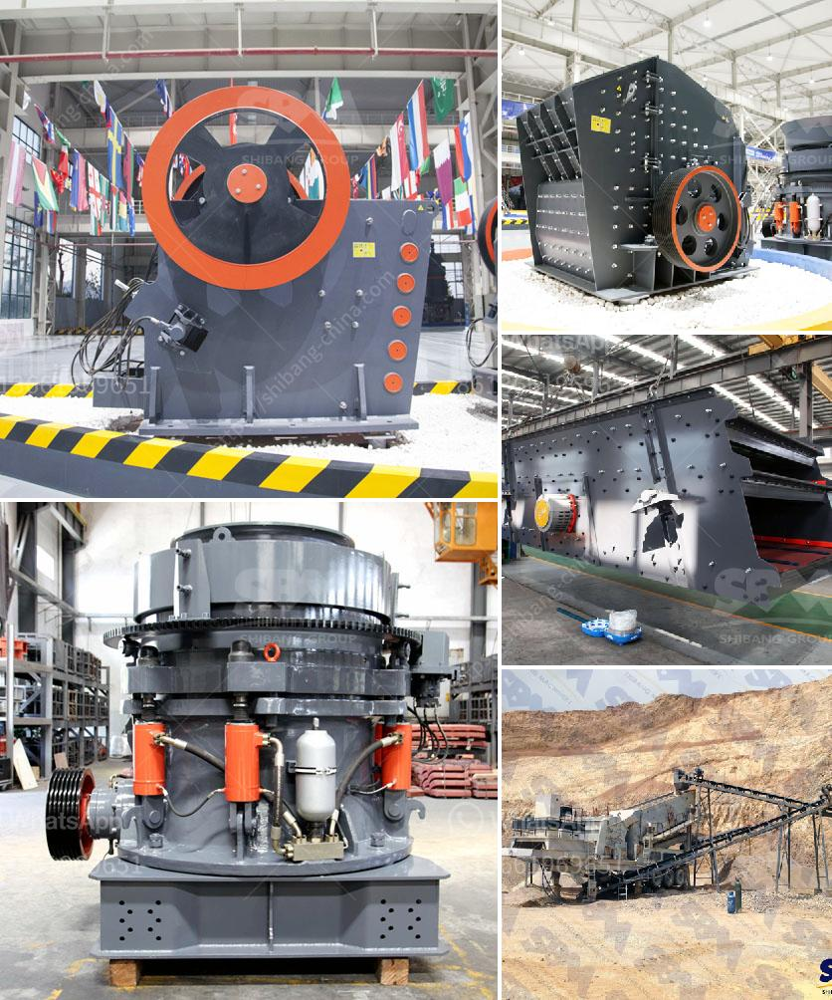

<h3>used crusher rock mining germany</h3>
Mining operations require heavy machinery to break down large rocks into smaller, more manageable pieces for further processing. The use of crushers is crucial in this process, as they enable efficient size reduction and ensure a consistent product size. Germany, being a country rich in natural resources and historically renowned for its mining industry, has a significant demand for crushers.

In recent years, the market for used crusher rock mining equipment in Germany has been thriving. Many mining companies prefer to invest in used crushers as they offer numerous advantages over new ones. Firstly, used crushers are significantly cheaper, making them a cost-effective choice for companies operating on tight budgets or looking to optimize their profit margins.

Secondly, used crushers in Germany often come with a warranty, providing reassurance to buyers. This allows mining companies to minimize the risks associated with machinery breakdowns, as any repairs or replacements can be covered under warranty. Additionally, many reputable dealers offer after-sales services and technical support, further enhancing the value proposition of used crushers.

Furthermore, Germany has a well-established mining infrastructure, making it easy to find reliable suppliers of used crusher rock mining equipment. There are numerous auctions, online marketplaces, and specialized dealers where mining companies can find a wide range of used crushers, tailored to their specific needs. This availability of options fosters healthy competition, driving down the overall costs and increasing the accessibility of used crushers.

The environmental benefits of using used crushers in Germany cannot be overlooked. By opting for preowned machinery, mining companies contribute to a circular economy by reducing the demand for new equipment. Manufacturing a new crusher requires significant amounts of raw materials and energy, resulting in higher carbon emissions and environmental impact. By extending the lifespan of existing crushers, the mining industry in Germany takes a more sustainable approach, aligning with global efforts to reduce carbon footprints.

Additionally, mining companies can utilize the already extracted minerals to their fullest potential by investing in used crushers. This not only reduces waste but also maximizes resource efficiency. The recycling of secondary materials and repurposing of existing equipment play a vital role in the transition to a greener mining industry, where sustainability and profitability go hand in hand.

In conclusion, the use of used crushers in rock mining operations in Germany presents numerous benefits for mining companies. From cost-effectiveness and warranties to environmental sustainability, choosing preowned machinery contributes to a circular economy, reduces carbon emissions, and optimizes resource efficiency. As the market for used crushers in Germany continues to grow, mining companies have access to a diverse range of options that cater to their specific requirements. Embracing this sustainable solution not only spares the environment but also enhances the profitability and long-term viability of the mining industry as a whole.
<h3>Contact us</h3><ul><li><strong>Whatsapp:&nbsp;<a href="https://wa.me/8613661969651">+8613661969651</a></strong></li><li><a href="https://swt.shibang-china.com/?git&amp;zhl&amp;used crusher rock mining germany"><strong>Online Service(chat now)</strong></a></li></ul><h3>Related</h3><ul><li><a href='mobile crusher parker 50th crusher for sale.md'>mobile crusher parker 50th crusher for sale</a></li><li><a href='stone crusher conveyors belt price.md'>stone crusher conveyors belt price</a></li><li><a href='sell jaw crusher.md'>sell jaw crusher</a></li><li><a href='rock crushers manufacturers.md'>rock crushers manufacturers</a></li><li><a href='crusher rock for sale.md'>crusher rock for sale</a></li></ul>