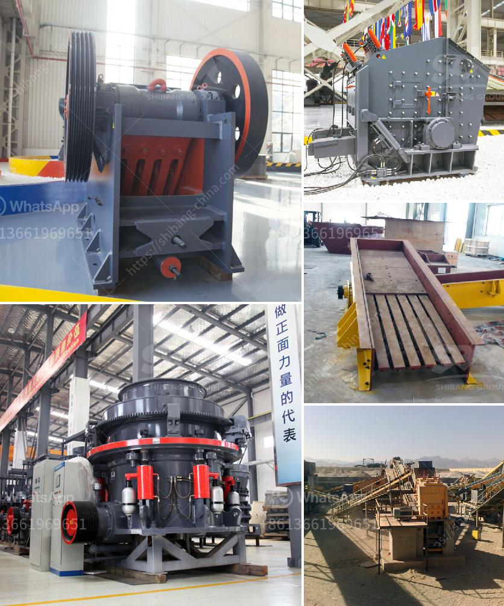

<h3>used ez screen plant 1200 xl for sale</h3>
Are you searching for a reliable and efficient screening plant for your construction or mining project? Look no further than the used EZ Screen Plant 1200 XL. This versatile and cost-effective machine is now available for sale, offering high performance and exceptional value for money. In this article, we will explore the features and benefits of the EZ Screen Plant 1200 XL and why it is an excellent investment for your business.

The EZ Screen Plant 1200 XL is a top-of-the-line screening plant designed to handle a wide range of materials, including soil, gravel, compost, and more. It is powered by a powerful 7-foot by 10-foot shaker box that ensures thorough and efficient screening. The machine can process up to 40 yards of material per hour, making it ideal for small to medium-sized projects.

One of the standout features of the EZ Screen Plant 1200 XL is its portability. This machine can be easily transported from one location to another, thanks to its lightweight design and convenient hitch attachment. The compact size and user-friendly controls make it easy to set up and operate, reducing downtime on the job site.

Another key advantage of the EZ Screen Plant 1200 XL is its versatility. With multiple mesh sizes and optional attachments, this screening plant can be customized to meet the specific needs of your project. Whether you need fine screening for soil or larger openings for gravel, the EZ Screen Plant 1200 XL can adapt to your requirements with ease.

The durability of the EZ Screen Plant 1200 XL is also worth mentioning. Constructed with high-quality materials and built to withstand heavy-duty use, this screening plant is designed to last. Its robust frame and components ensure reliable operation, even in the harshest working conditions. Moreover, the machine requires minimal maintenance, reducing the overall cost of ownership.

Investing in a used EZ Screen Plant 1200 XL can be a cost-effective choice for your business. Used equipment often comes at a fraction of the cost of new machinery, offering significant savings on your initial investment. However, it is essential to choose a reputable seller to ensure the quality and reliability of the equipment. Look for a dealer who can provide a detailed history of the machine and offer a warranty for your peace of mind.

In conclusion, the used EZ Screen Plant 1200 XL is an excellent option for anyone in need of a reliable and efficient screening plant. Its versatility, portability, and durability make it a valuable asset for a wide range of industries. With its high processing capacity and customizable features, this machine can help you streamline your operations and increase productivity. Whether you are in the construction, mining, or landscaping industry, consider investing in a used EZ Screen Plant 1200 XL for a cost-effective screening solution.
<h3>Contact us</h3><ul><li><strong>Whatsapp:&nbsp;<a href="https://wa.me/8613661969651">+8613661969651</a></strong></li><li><a href="https://swt.shibang-china.com/?git&amp;zhl&amp;used ez screen plant 1200 xl for sale"><strong>Online Service(chat now)</strong></a></li></ul><h3>Related</h3><ul><li><a href='jaw crusher price 200mm.md'>jaw crusher price 200mm</a></li><li><a href='jaw crushers for sale in uganda.md'>jaw crushers for sale in uganda</a></li><li><a href='puzzolana 100tph cone crusher plant price.md'>puzzolana 100tph cone crusher plant price</a></li><li><a href='cement plant grinding unit.md'>cement plant grinding unit</a></li><li><a href='mobile glass crushing plant.md'>mobile glass crushing plant</a></li></ul>