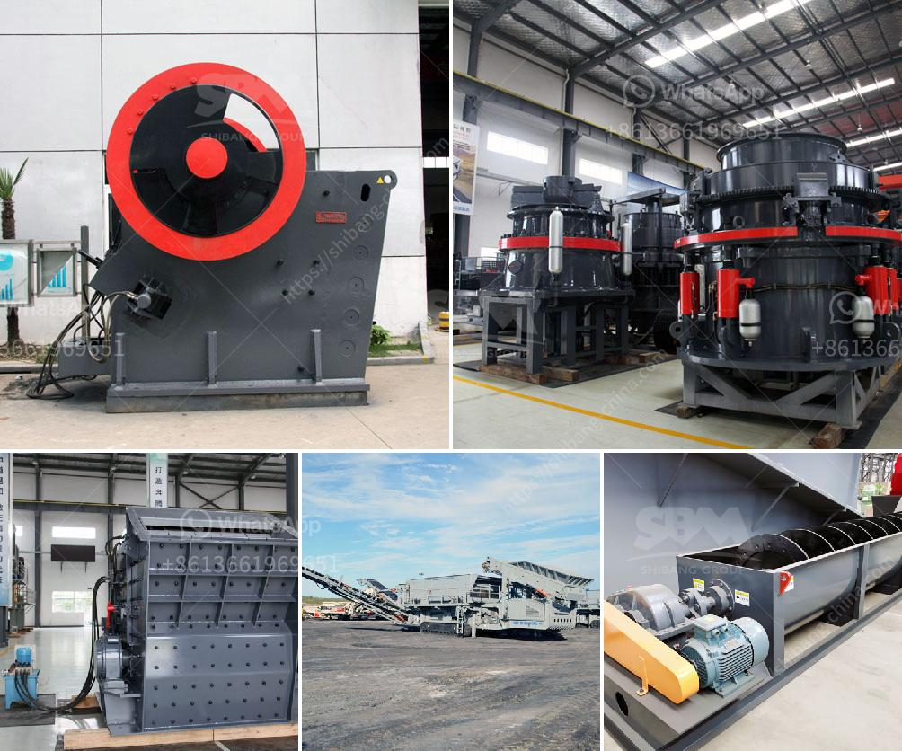

<h3>used gold crusher for sale in tanzania</h3>
Tanzania is one of Africa's leading gold-producing countries, with substantial untapped resources still being discovered. Since the first gold rush in 1896, gold mining has attracted both local and foreign investments, making Tanzania rich in gold deposits. As a result, there is a continuous demand for gold crushers in the country.

A gold crusher is used to break large gold rocks into smaller particles, enabling the extraction of this precious metal. Crushing is an essential stage in the gold mining process, as it prepares the ore for further processing. The crushing process usually involves primary and secondary crushers that break down the ore into smaller pieces, facilitating exploration, extraction, and refining.

The market for used gold crushers in Tanzania has been growing significantly due to various factors. Firstly, the cost of purchasing new equipment can be high, particularly for small-to-medium scale miners with limited capital. Therefore, used crushers provide a more affordable option, allowing miners to exploit their gold resources without excessive financial burden.

Secondly, the availability of used crushers in Tanzania is relatively high. Many mining operations have scaled down or ceased production, leading to a surplus of equipment on the market. This surplus has created opportunities for other miners to acquire used crushers at competitive prices.

Moreover, the durability and reliability of gold crushers make them ideal for reuse. Most crushers are built to withstand demanding conditions and have longer lifespans, making them a viable and cost-effective option for anyone looking to enter the gold mining industry in Tanzania.

Lastly, the demand for gold crushers in Tanzania is also fueled by the increasing number of artisanal and small-scale miners in the country. These miners often lack the capital and technology to invest in new equipment, so they heavily rely on the used market. Used gold crushers offer them a chance to establish their operations without incurring hefty costs.

In conclusion, the availability and affordability of used gold crushers have made them a popular choice for miners in Tanzania. With the country's rich gold deposits and a growing number of small-scale miners, the demand for these crushers is unlikely to decline anytime soon. As Tanzania continues to attract investors and explore new gold reserves, the market for used gold crushers will remain strong, contributing to the country's growing gold mining sector.
<h3>Contact us</h3><ul><li><strong>Whatsapp:&nbsp;<a href="https://wa.me/8613661969651">+8613661969651</a></strong></li><li><a href="https://swt.shibang-china.com/?git&amp;zhl&amp;used gold crusher for sale in tanzania"><strong>Online Service(chat now)</strong></a></li></ul><h3>Related</h3><ul><li><a href='safety of belt conveyors in hindi.md'>safety of belt conveyors in hindi</a></li><li><a href='sample quotation letter for sand and stone.md'>sample quotation letter for sand and stone</a></li><li><a href='california rock crusher machine.md'>california rock crusher machine</a></li><li><a href='small crushers for sale.md'>small crushers for sale</a></li><li><a href='tph mobile crushing plant.md'>tph mobile crushing plant</a></li></ul>