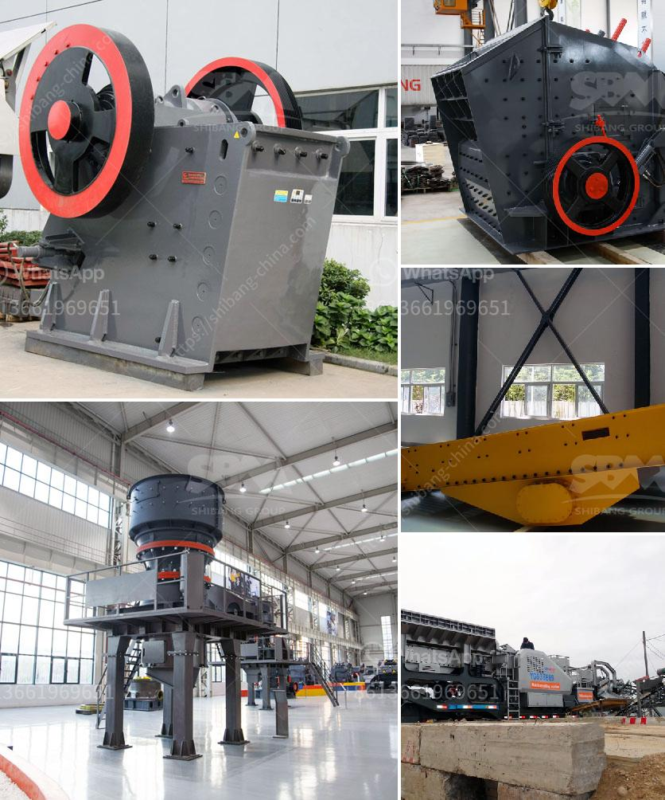

<h3>used in vibrating screens</h3>
Vibrating screens are a common equipment used in many industries to separate and grade different materials based on their size. They are applied in agriculture, mining, construction, and other sectors for various applications such as sorting, screening, and dewatering of materials. One crucial component in vibrating screens is the use of screens or mesh, which play a key role in the efficiency and effectiveness of the entire process.

When it comes to vibrating screens, the screens themselves are usually made of wire mesh or perforated plates. These screens are selected based on the specific application and the desired size separation. The size of the mesh or perforation openings in the screen determines the size of the particles that can pass through it. For example, a screen with larger openings will allow bigger particles to pass through, while smaller particles will be retained.

The use of screens in vibrating screens offers several advantages. Firstly, they allow for efficient separation of materials based on their size. By using screens with different opening sizes, it is possible to obtain multiple-sized fractions of the material, which can then be further processed or used for different purposes.

Secondly, screens in vibrating screens help prevent the contamination of the final product. They can separate unwanted materials such as debris, oversized particles, or foreign objects from the desired material. This is especially crucial in industries like food processing, where hygiene and quality control are paramount.

Furthermore, screens in vibrating screens contribute to the overall performance and longevity of the equipment. By filtering and separating materials, they reduce the load on other components of the vibrating screen, such as the motor and supporting structure. This, in turn, improves the overall operational efficiency and extends the lifespan of the equipment.

In terms of the specific screen used in vibrating screens, mesh screens are commonly used due to their versatility and effectiveness. Mesh screens are made of woven wires with specific opening sizes. The wires are interwoven to create a robust and flexible screen that can withstand the vibrations and impacts during operation.

Perforated plates, on the other hand, consist of metal sheets with holes of different sizes and shapes. These plates offer high open area and are suitable for applications where larger particles need to be separated.

Both mesh screens and perforated plates can be easily interchanged or replaced in vibrating screens, allowing for flexibility and customization to suit different materials and separation requirements. They can also be easily cleaned or replaced when they become worn or damaged.

In conclusion, screens play a crucial role in the effective operation of vibrating screens. They enable efficient size separation, prevent contamination, and contribute to the overall performance and longevity of the equipment. Whether it is wire mesh or perforated plates, screens are a vital component in vibrating screens that enhance productivity and ensure high-quality output in various industries.
<h3>Contact us</h3><ul><li><strong>Whatsapp:&nbsp;<a href="https://wa.me/8613661969651">+8613661969651</a></strong></li><li><a href="https://swt.shibang-china.com/?git&amp;zhl&amp;used in vibrating screens"><strong>Online Service(chat now)</strong></a></li></ul><h3>Related</h3><ul><li><a href='vertical mill of a cement company.md'>vertical mill of a cement company</a></li><li><a href='quarry business plan sample.md'>quarry business plan sample</a></li><li><a href='quartz grinding mill.md'>quartz grinding mill</a></li><li><a href='mobile crusher company.md'>mobile crusher company</a></li><li><a href='used stone crushers for sale india.md'>used stone crushers for sale india</a></li></ul>