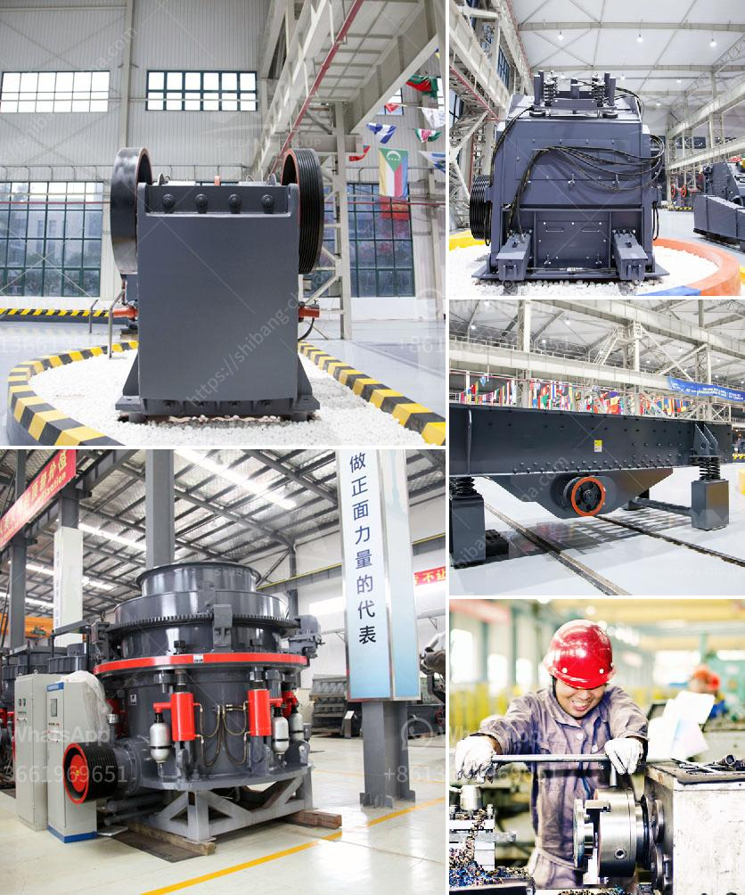

<h3>used industrial stone crushers for sale</h3>
Stone crushers are used to reduce the size, or change the form, of waste materials so they can be more easily disposed of or recycled, or to reduce the size of a solid mix of raw materials (as in rock ore), so that pieces of different composition can be differentiated. Crushing is the process of transferring a force amplified by mechanical advantage through a material made of molecules that bond together more strongly, and resist deformation more, than those in the material being crushed.

Industrial stone crushers are being used extensively in large scale mining and construction projects for crushing rocks and other materials into smaller pieces. There are several types of crushers such as jaw crushers, impact crushers, gyratory crushers, cone crushers, and vertical shaft impact crushers, each with its own unique characteristics.

Jaw crushers are commonly used in the mining and construction industry because of their ability to crush materials of any hardness, as well as their low-cost operation and easy maintenance. They consist of two jaws, one fixed and the other reciprocating, and the material is fed into the chamber from the top and crushed between the jaws. Some of the popular brands of jaw crushers available in the used market are Pioneer, Harison, Cedarapids, Tesab, Metso, and Universal.

Impact crushers are designed for high production and high reduction ratio, and can be used for both primary and secondary crushing. They are commonly used to crush medium-hard to hard rocks, such as limestone, granite, basalt, and concrete. Impact crushers operate by throwing the material against the anvils inside the crushing chamber, causing it to break into smaller pieces. Some well-known brands of impact crushers in the used market are Hazemag, McCloskey, Tesab, Lippmann, and Sandvik.

Gyratory crushers are used in the mining industry to break and crush rock material. They are one of the most preferred crushers due to their ability to crush materials of high hardness and compressive strength. Gyratory crushers consist of a concave surface and a conical head, with the ore being fed into the top and crushed between the two surfaces. Well-known brands in the market for gyratory crushers include Allis-Chalmers, Metso, Nordberg, and Sandvik.

Cone crushers are widely used in the quarrying and mining industries. They are typically used as secondary crushers to reduce the size of the material coming from the primary crusher. Cone crushers operate by squeezing the material between an eccentrically rotating cone and a concave wall. Popular brands of cone crushers in the used market are Symons, Telsmith, and Terex.

Vertical shaft impact crushers, also known as VSI crushers, are widely used for particle shaping and sand making applications. They are commonly used in the aggregate, mining, and construction industries. VSI crushers operate by throwing the material against the anvils or rock-lined crushing chamber, causing it to break into smaller pieces. Well-known brands of VSI crushers in the used market are Metso, Terex, Cedarapids, and Barmac.

In conclusion, used industrial stone crushers are becoming increasingly popular in the mining and construction industries due to their low-cost operation, high productivity, and ease of maintenance. Whether you're in need of a jaw crusher, impact crusher, gyratory crusher, cone crusher, or a vertical shaft impact crusher, we have the right combination of size, style, and price to fit your needs. With so many options available, it's easy to find a used industrial stone crusher that meets your specific requirements without breaking the bank.
<h3>Contact us</h3><ul><li><strong>Whatsapp:&nbsp;<a href="https://wa.me/8613661969651">+8613661969651</a></strong></li><li><a href="https://swt.shibang-china.com/?git&amp;zhl&amp;used industrial stone crushers for sale"><strong>Online Service(chat now)</strong></a></li></ul><h3>Related</h3><ul><li><a href='mobile jaw crusher tons per hour.md'>mobile jaw crusher tons per hour</a></li><li><a href='automation coal crushing and conveyor.md'>automation coal crushing and conveyor</a></li><li><a href='limestone processing plant philippines.md'>limestone processing plant philippines</a></li><li><a href='raymond grinding mill for sale in thailand.md'>raymond grinding mill for sale in thailand</a></li><li><a href='two prefabricated concrete production line.md'>two prefabricated concrete production line</a></li></ul>