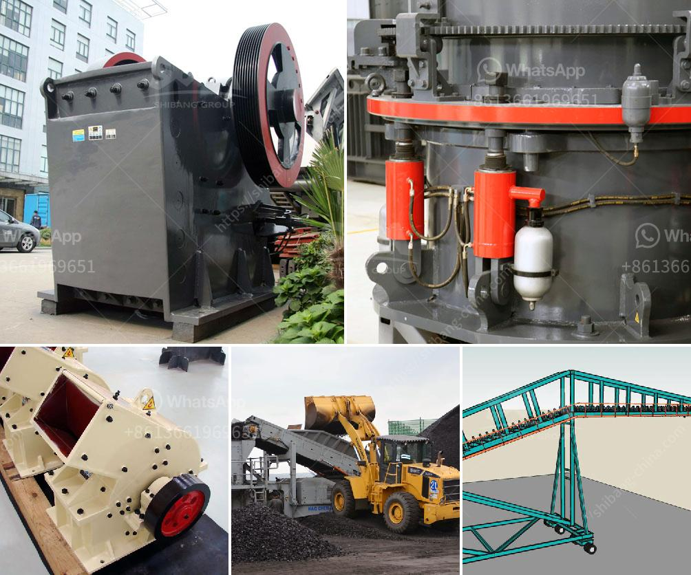

<h3>used iron ore equipment for sale</h3>
Iron ore is an essential raw material for industries worldwide. It is used to make steel, which is a crucial component in construction, automobiles, machinery, and many other industries. For this reason, iron ore production is of great importance in economic development.

When it comes to extracting iron ore from the earth, there are several processes and machinery involved. The most common method is open pit mining, where large-scale equipment is used to remove the earth that covers the iron ore deposit. Once the ore is exposed, it is then drilled, blasted, and transported to crushing and screening plants to be processed further.

Over time, mining companies, both large corporations and small-scale operations, upgrade their equipment or replace it with newer models. As a result, used iron ore equipment becomes available for sale. These used machines can significantly reduce upfront costs for new mining operations, while still delivering reliable performance.

There are several types of equipment used in the iron ore mining process. Some of the commonly used machines include excavators, draglines, drills, loaders, haul trucks, crushers, and grinding mills. Each of these machines has its specific use and plays a vital role in mining operations.

For example, excavators are used to dig trenches and remove the top layer of soil and rocks before extracting the iron ore. Draglines, on the other hand, are enormous machines that are incredibly efficient at removing large quantities of earth in a single operation. Drills are used to create holes in the ground, which are then filled with explosives to blast away the overlying soil and rocks.

The availability of used iron ore equipment for sale offers many benefits to mining operations. Lower upfront costs are one of the most significant advantages. By purchasing used equipment, mining companies can significantly reduce their capital expenditures, freeing up funds for other essential aspects of the operation.

In addition to cost savings, used equipment often requires less lead time for delivery compared to purchasing new models. This means that mining operations can start sooner and begin generating much-needed revenue more quickly.

However, it is essential to approach used equipment purchases with caution. It is crucial to thoroughly inspect and evaluate the condition of the equipment before making a purchase. While used equipment can offer cost savings, it is essential to ensure that it is in good working condition and will not require excessive maintenance or repairs.

Mining operations can find used iron ore equipment for sale through various channels. Online marketplaces and auctions are common platforms where mining companies can browse and shop for used machinery. Additionally, industry publications and trade shows often feature advertisements and exhibitions where used equipment is showcased and made available for sale.

In conclusion, used iron ore equipment provides a cost-effective solution for mining companies looking to reduce their upfront expenses without compromising on performance. By purchasing reliable used machinery, mining operations can start sooner, generate revenue more quickly, and enhance overall profitability. However, it is crucial to conduct thorough inspections and evaluations before purchasing used equipment to ensure its quality and reliability.
<h3>Contact us</h3><ul><li><strong>Whatsapp:&nbsp;<a href="https://wa.me/8613661969651">+8613661969651</a></strong></li><li><a href="https://swt.shibang-china.com/?git&amp;zhl&amp;used iron ore equipment for sale"><strong>Online Service(chat now)</strong></a></li></ul><h3>Related</h3><ul><li><a href='silica sand washing plant.md'>silica sand washing plant</a></li><li><a href='crushed plant mobile coquimbo.md'>crushed plant mobile coquimbo</a></li><li><a href='machinery for starch plant japan.md'>machinery for starch plant japan</a></li><li><a href='crusher machine in bhutan.md'>crusher machine in bhutan</a></li><li><a href='35 in raymond vertical roller mill.md'>35 in raymond vertical roller mill</a></li></ul>