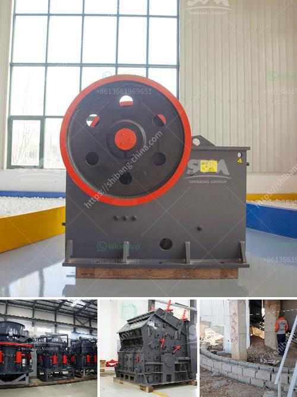

<h3>used machine hammer mill</h3>
The machine hammer mill is a versatile and powerful machine used for grinding, shredding, and pulverizing a wide range of materials. This machine is commonly used in various industries, including recycling, agriculture, pharmaceutical, and mining. With its robust construction and high-speed operation, the hammer mill is capable of processing large quantities of material in a short period.

One of the major benefits of using a used machine hammer mill is cost-effectiveness. Purchasing a used machine can save a significant amount of money compared to buying a new one. Many companies upgrade their equipment or change their production processes, making their used hammer mills available for sale. This allows buyers to acquire a reliable and high-quality machine at a fraction of the cost.

Moreover, used hammer mills have proven their durability and dependability. These machines are designed to withstand heavy-duty applications and require minimal maintenance. By purchasing a reputable brand, buyers can be confident in the performance and longevity of their used hammer mill.

The size and capacity of the hammer mill can vary, depending on the specific requirements of the application. Some models are portable and compact, making them suitable for small-scale operations, while others are larger, with high-capacity hoppers for processing large volumes of material. Regardless of the size, the hammer mill operates on the same principle – a series of hammers, mounted on a rotating shaft, impact the material to be ground, reducing it to the desired particle size.

In conclusion, a used machine hammer mill offers cost-effectiveness, durability, and versatility. Whether you need to grind, shred, or pulverize materials, this machine is a reliable choice. With proper maintenance, a used hammer mill can provide years of efficient operation and contribute to the productivity of your operation.
<h3>Contact us</h3><ul><li><strong>Whatsapp:&nbsp;<a href="https://wa.me/8613661969651">+8613661969651</a></strong></li><li><a href="https://swt.shibang-china.com/?git&amp;zhl&amp;used machine hammer mill"><strong>Online Service(chat now)</strong></a></li></ul><h3>Related</h3><ul><li><a href='quarry rock stone crusher germany machine manufacturer.md'>quarry rock stone crusher germany machine manufacturer</a></li><li><a href='grinding mill made in germany.md'>grinding mill made in germany</a></li><li><a href='two roll mill supply in sri lanka.md'>two roll mill supply in sri lanka</a></li><li><a href='grinding mill machine cost price south africa.md'>grinding mill machine cost price south africa</a></li><li><a href='salt processing plant machinery.md'>salt processing plant machinery</a></li></ul>