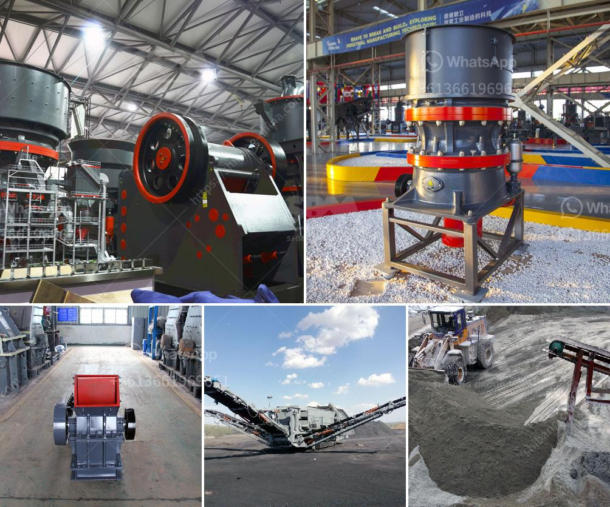

<h3>used mobile crushing plant trailer</h3>
Used mobile crushing plant trailer is a versatile, maneuverable, and reliable piece of equipment that offers a cost-effective solution for stone crushing and recycling applications. These trailers have a compact design that allows them to be easily transported from one site to another, making them ideal for construction projects or on-site recycling operations.

One of the key advantages of using a used mobile crushing plant trailer is its flexibility. It can be used to crush various types of materials, including concrete, asphalt, and brick. This makes it a valuable tool for contractors, as it eliminates the need to transport and dispose of these materials separately. In addition, the trailer can be quickly set up and ready to operate, saving time and money on project timelines.

The used mobile crushing plant trailer is also efficient in terms of energy consumption. It is powered by a diesel engine, which offers high performance and economical fuel consumption. This translates to significant savings in operational costs for the user.

Furthermore, these trailers are equipped with advanced crushing technology to ensure high-quality and consistent output. They are designed with a heavy-duty construction, including reinforced steel, to withstand the rigors of the job site. This durability helps prolong the lifespan of the equipment, reducing the need for frequent repairs or replacements.

The used mobile crushing plant trailer is also equipped with safety features to ensure operator protection. It includes an emergency stop button, safety guards, and warning signs to prevent accidents and injuries.

Overall, the used mobile crushing plant trailer is a reliable and cost-effective solution for stone crushing and recycling applications. Its versatility, maneuverability, and efficiency make it an essential tool for construction projects or on-site recycling operations. By investing in a used mobile crushing plant trailer, contractors can enhance their productivity, reduce operational costs, and contribute to environmental sustainability.
<h3>Contact us</h3><ul><li><strong>Whatsapp:&nbsp;<a href="https://wa.me/8613661969651">+8613661969651</a></strong></li><li><a href="https://swt.shibang-china.com/?git&amp;zhl&amp;used mobile crushing plant trailer"><strong>Online Service(chat now)</strong></a></li></ul><h3>Related</h3><ul><li><a href='hammer mill prices.md'>hammer mill prices</a></li><li><a href='quarry crusher plant in ethiopia.md'>quarry crusher plant in ethiopia</a></li><li><a href='alluvial gold plants for sale south africa.md'>alluvial gold plants for sale south africa</a></li><li><a href='slag jaw crusher long size.md'>slag jaw crusher long size</a></li><li><a href='crusher and producton per hour.md'>crusher and producton per hour</a></li></ul>