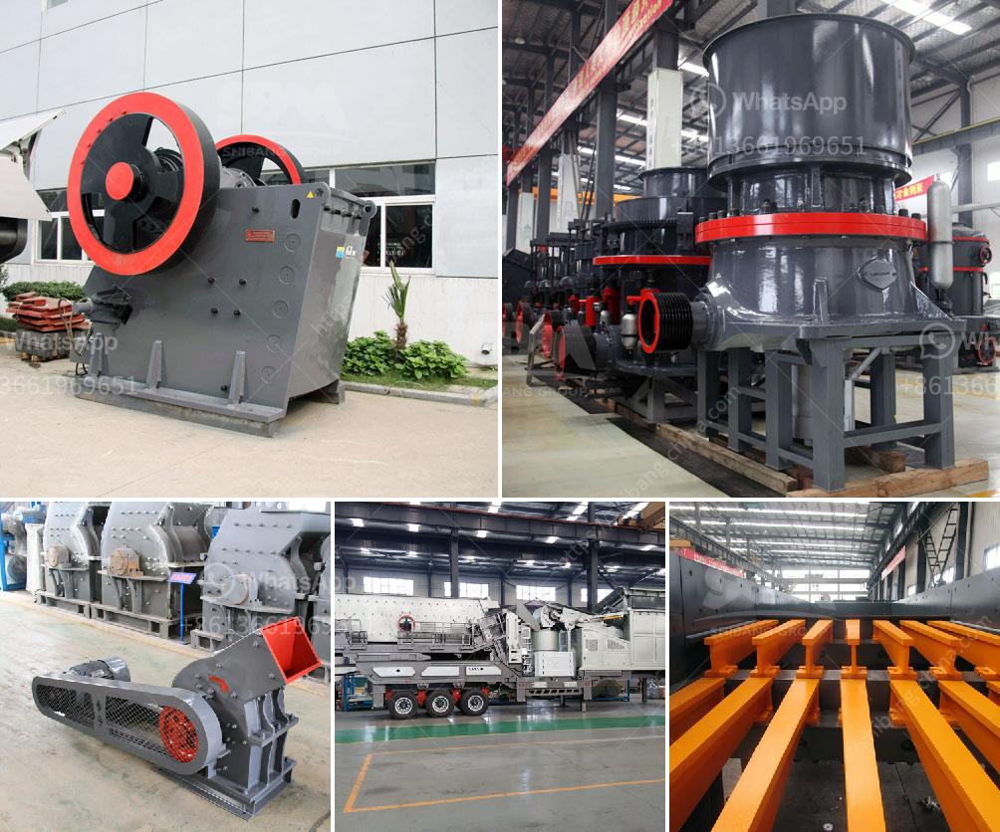

<h3>used mobile jaw crusher sale</h3>
A mobile jaw crusher is a versatile and efficient piece of equipment that can be used in a wide range of industries. No matter what line of work you’re in, whether it is construction, mining, or demolition, a jaw crusher can meet your needs. It enables you to process various types of materials quickly and easily.

When it comes to purchasing a used mobile jaw crusher, it is important to do your research to ensure you are getting a quality machine that will meet your requirements. There are several factors to consider, such as the age and condition of the equipment, the hours it has been used for, and the type of materials it has been used to process.

One advantage of buying a used mobile jaw crusher is the potential cost savings compared to buying new. The price may be significantly lower, allowing you to stretch your budget further. However, it is crucial to inspect the machine thoroughly and look out for any signs of wear and tear. Components such as the engine, the conveyor belts, and the hydraulic system should be in good working condition.

Before finalizing the purchase, it is recommended to conduct a test run and check the jaw crusher's performance. Make sure it operates smoothly and efficiently while processing the materials you intend to use it for.

It is also worth considering the manufacturer and model of the used mobile jaw crusher. Some manufacturers are known for producing reliable and durable machines, while others may have a less favorable reputation. Researching the model and reading customer reviews can help you assess the quality and reliability of the equipment.

In conclusion, buying a used mobile jaw crusher can be a cost-effective solution for businesses looking to expand their capabilities. However, thorough research, inspections, and test runs are essential to ensure the equipment is in optimal working condition. By doing your due diligence, you can acquire a reliable and efficient machine that will suit your needs and withstand the demands of your industry.
<h3>Contact us</h3><ul><li><strong>Whatsapp:&nbsp;<a href="https://wa.me/8613661969651">+8613661969651</a></strong></li><li><a href="https://swt.shibang-china.com/?git&amp;zhl&amp;used mobile jaw crusher sale"><strong>Online Service(chat now)</strong></a></li></ul><h3>Related</h3><ul><li><a href='double toggle jaw crushers.md'>double toggle jaw crushers</a></li><li><a href='how much can a quarry plant cost.md'>how much can a quarry plant cost</a></li><li><a href='how to decrease the dust in a crushing plant.md'>how to decrease the dust in a crushing plant</a></li><li><a href='mini cement plant project report.md'>mini cement plant project report</a></li><li><a href='companies that manufacture ball mill.md'>companies that manufacture ball mill</a></li></ul>