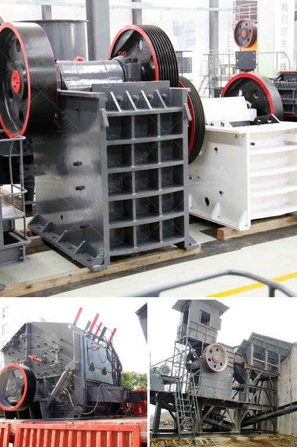

<h3>used portable crushing plant philippines</h3>
The Philippines has abundant mineral resources, yet mining activities in the country have been limited due to various challenges, such as the remote locations of ore deposits and the high costs involved in establishing fixed crushing plants. However, the emergence of used portable crushing plants has opened up new opportunities for mining companies to efficiently extract and process ores, while minimizing costs and environmental impact. This article explores the benefits and potential of used portable crushing plants in the Philippines.

Used portable crushing plants offer a cost-effective solution for mining companies looking to expand their operations. Unlike fixed crushing plants, portable plants can be easily relocated to different mining sites, allowing miners to access mineral deposits in remote or hard-to-reach areas. Additionally, portable plants eliminate the need for costly infrastructure development, such as constructing access roads or installing concrete foundations, resulting in significant savings.

By using portable crushing plants, mining companies can quickly and efficiently extract valuable minerals from their ore deposits. Portable crushers can crush large rocks into smaller pieces, allowing easier access to valuable minerals embedded within the ore. This reduces the need for manual labor and explosives, resulting in higher productivity and increased mineral recovery rates.

Used portable crushing plants offer an environmentally friendly alternative to traditional mining methods. Portable plants have built-in dust suppression systems, reducing the release of harmful particles into the air. Additionally, portable plants produce less noise pollution compared to fixed crushing plants, minimizing disturbances to nearby communities and wildlife habitats. This makes them ideal for environmentally sensitive or protected areas, such as national parks or biodiversity hotspots.

Portable crushing plants provide mining companies with enhanced flexibility and adaptability. They can be easily modified or upgraded to accommodate changes in ore grade, deposit size, or processing requirements. This allows companies to adjust their crushing operations in real-time, optimizing productivity and minimizing downtime. Moreover, portable plants can be equipped with various screening and washing equipment, enabling mining companies to produce different grades of final products.

Used portable crushing plants have revolutionized the mining industry in the Philippines, enabling companies to efficiently extract and process ores in remote locations while minimizing costs and environmental impact. With their cost-effectiveness, efficiency, and flexibility, portable plants have become a valuable asset for mining companies looking to expand their operations or venture into previously untapped mineral deposits. By embracing these innovative solutions, the Philippines can unleash its full mining potential, contributing to economic growth and job creation while ensuring sustainable and responsible resource exploration and extraction.
<h3>Contact us</h3><ul><li><strong>Whatsapp:&nbsp;<a href="https://wa.me/8613661969651">+8613661969651</a></strong></li><li><a href="https://swt.shibang-china.com/?git&amp;zhl&amp;used portable crushing plant philippines"><strong>Online Service(chat now)</strong></a></li></ul><h3>Related</h3><ul><li><a href='concrete crusher in georgia.md'>concrete crusher in georgia</a></li><li><a href='artificial sand project.md'>artificial sand project</a></li><li><a href='crusher stone durban.md'>crusher stone durban</a></li><li><a href='indonesia raymond mill import agent.md'>indonesia raymond mill import agent</a></li><li><a href='24 36 jaw crusher for sale usa.md'>24 36 jaw crusher for sale usa</a></li></ul>