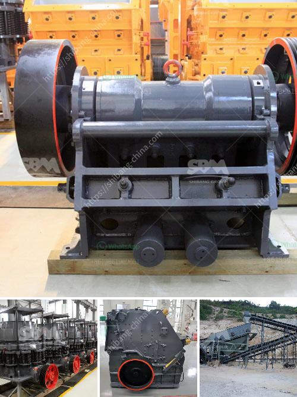

<h3>used quarry crusher machine germany</h3>
Germany, known for its engineering prowess and precision manufacturing, is a hub for high-quality machinery. One such machine that has gained significant popularity in the quarrying industry is the used quarry crusher machine. With advancements in technology and stringent environmental regulations, quarrying companies are turning to these machines for their reliability, efficiency, and eco-friendly features.

The used quarry crusher machine Germany offers is an old but fully functional machine that has been well-maintained and cared for over its years of operation. It is highly sought after by quarry operators as it offers an economical solution for replacing worn-out or outdated crushing equipment.

These machines are designed to extract and process stones and minerals from the Earth's crust. They work by breaking down large rocks into smaller, more manageable sizes, which are then used for various construction purposes. The Germany-made crushers are known for their robustness and durability, making them suitable for even the toughest quarrying conditions.

One of the significant advantages of using a used quarry crusher machine from Germany is its efficiency in reducing operating costs. These machines are designed to operate at high capacities while consuming minimal energy. This translates into lower electricity bills and reduced carbon footprint, a win-win situation for both quarry operators and the environment.

Additionally, these machines are equipped with advanced crushing technologies, such as hydraulic systems and automated control panels. This ensures precise and consistent crushing operations, leading to higher product quality and reduced waste. The Germany-made crushers are also known for their low maintenance requirements and extended service life, further contributing to cost savings.

Another crucial aspect of the used quarry crusher machine Germany is its compliance with strict environmental regulations. Quarrying operations are subject to various environmental restrictions, such as noise and dust emissions limits. The Germany-made crushers are designed to minimize these impacts by incorporating noise reduction measures and dust suppression systems. This enables quarry operators to meet stringent environmental standards and continue their operations sustainably.

Furthermore, the versatility of these machines allows them to handle a wide range of materials, from limestone and granite to asphalt and concrete. This flexibility enables quarry operators to cater to diverse construction needs, expanding their customer base and increasing profitability.

Quarrying has always been a critical industry for the construction sector, providing essential materials for building infrastructure. As the demand for high-quality aggregates increases, quarry operators must rely on efficient and reliable crushing equipment. The used quarry crusher machine Germany is the ideal choice for quarry operators looking for a cost-effective and eco-friendly solution.

In conclusion, Germany's reputation for manufacturing excellence extends to the used quarry crusher machines. These machines offer efficient and reliable crushing operations, low operating costs, compliance with environmental regulations, and versatility in handling various materials. Quarry operators looking to upgrade their crushing equipment can rely on these Germany-made machines to enhance their productivity and sustainability.
<h3>Contact us</h3><ul><li><strong>Whatsapp:&nbsp;<a href="https://wa.me/8613661969651">+8613661969651</a></strong></li><li><a href="https://swt.shibang-china.com/?git&amp;zhl&amp;used quarry crusher machine germany"><strong>Online Service(chat now)</strong></a></li></ul><h3>Related</h3><ul><li><a href='how to start stone crusher project.md'>how to start stone crusher project</a></li><li><a href='sand making machine application.md'>sand making machine application</a></li><li><a href='micro fine grinding mill morrison.md'>micro fine grinding mill morrison</a></li><li><a href='jaw crusher 150 ton pricing.md'>jaw crusher 150 ton pricing</a></li><li><a href='copper ore vertical ball mill.md'>copper ore vertical ball mill</a></li></ul>