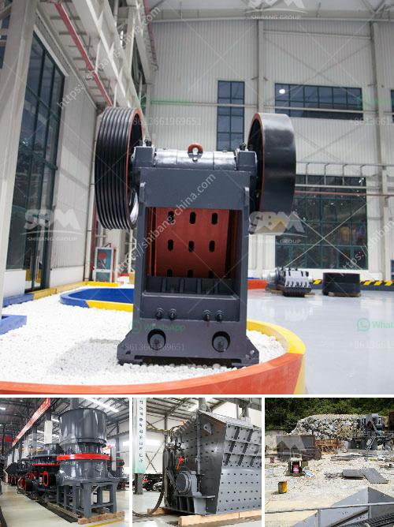

<h3>used sand making machine dealers</h3>
Construction projects require various types of machinery and equipment to ensure efficiency and productivity. Sand making machines are widely used in the construction industry to produce sand and aggregate for building materials. While purchasing a brand-new sand making machine may not be financially feasible for some construction companies, there is a budget-friendly alternative – buying from used sand making machine dealers.

Used sand making machine dealers offer a wide range of options when it comes to purchasing this essential equipment at a fraction of the cost of buying new. These dealers specialize in acquiring pre-owned machines from construction companies, refurbishing them, and reselling them to businesses at a discounted price. By opting for a used machine, construction companies can save a significant amount of money while still acquiring a reliable and functional sand making machine.

One of the primary advantages of purchasing from used sand making machine dealers is cost savings. Construction projects often face budget constraints, and investing in a brand-new sand making machine may not be financially viable. By buying a used machine, companies can save as much as 40-60% compared to purchasing new. This substantial cost reduction allows businesses to allocate their funds to other essential aspects of the project, such as labor, materials, and other equipment.

Contrary to common misconceptions, used sand making machines from reputable dealers can offer similar performance to new machines. These dealers thoroughly inspect and refurbish the machines to ensure they are in excellent working condition. They address issues, replace worn-out parts, and conduct necessary repairs to restore the equipment to its optimal performance. By purchasing from these dealers, construction companies can have confidence in the reliability and longevity of their sand making machine.

Aside from cost savings and performance, another advantage of buying from used sand making machine dealers is the availability of a wide selection of models and types. These dealers usually have a variety of machines in their inventory, allowing companies to choose the one that best suits their specific needs. Whether it is a small portable sand making machine for a small project or a large-scale stationary machine for massive construction projects, there is a used machine available to meet every requirement.

Moreover, used sand making machine dealers often provide after-sales service and support. They offer installation assistance, training for machine operation, and ongoing maintenance services. This ensures that companies buying from these dealers can receive the necessary assistance throughout the lifespan of their equipment.

In conclusion, used sand making machine dealers offer a cost-effective solution for construction companies in need of this essential equipment. By purchasing from these dealers, companies can save a significant amount of money while still acquiring reliable machines that deliver optimal performance. The availability of various models and the after-sales support provided make the deal even more enticing. So, if you are planning a construction project and looking to invest in a sand making machine, consider exploring the options offered by reputable used machine dealers.
<h3>Contact us</h3><ul><li><strong>Whatsapp:&nbsp;<a href="https://wa.me/8613661969651">+8613661969651</a></strong></li><li><a href="https://swt.shibang-china.com/?git&amp;zhl&amp;used sand making machine dealers"><strong>Online Service(chat now)</strong></a></li></ul><h3>Related</h3><ul><li><a href='crushing machine manufacturer in maharashtra.md'>crushing machine manufacturer in maharashtra</a></li><li><a href='simple diagram for high energy ball milling.md'>simple diagram for high energy ball milling</a></li><li><a href='screener crusher china.md'>screener crusher china</a></li><li><a href='defination of machine aggregate crusher.md'>defination of machine aggregate crusher</a></li><li><a href='gold mining equipment for sale in singapore.md'>gold mining equipment for sale in singapore</a></li></ul>