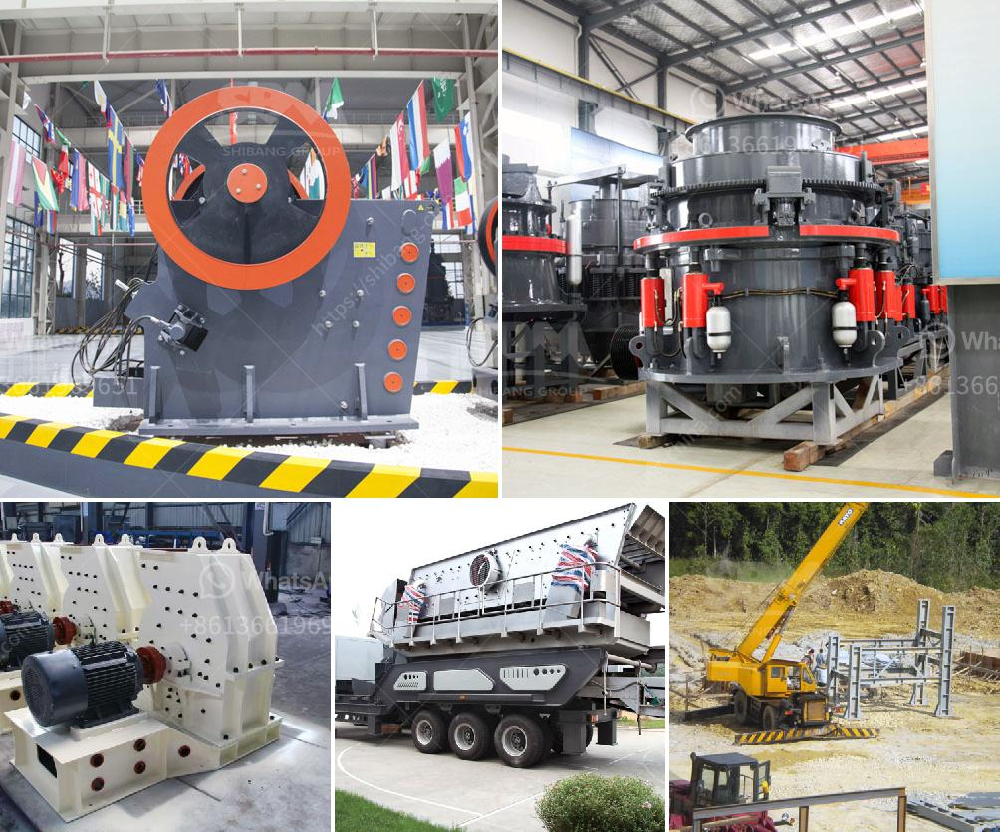

<h3>used sand screen in south africa sale</h3>
South Africa, renowned for its diverse landscapes and rich mineral resources, has been a hub for the mining industry for decades. As mining activities continue to thrive, optimizing efficiency and cost-effectiveness has become crucial. One area where significant savings can be made is the acquisition of used sand screens. This article explores the market for used sand screens in South Africa and highlights the benefits of investing in these cost-saving alternatives.

The mining industry heavily relies on sand screens to separate and classify various materials. While new sand screens can be expensive, opting for used units offers a cost-effective solution without compromising on quality. By purchasing used sand screens, mining companies can significantly reduce capital expenditures, allowing them to allocate funds to other critical aspects of their operations such as maintenance and expansion projects.

The perception that used equipment is of compromised quality is an outdated stereotype. With advancements in technology and stringent quality control measures, used sand screens can offer the same level of performance and durability as their new counterparts. Reputable sellers typically ensure that their used equipment is thoroughly inspected, reconditioned if necessary, and guaranteed to meet industry standards. This provides customers with reliable and efficient machinery that meets their operational requirements.

The used sand screen market in South Africa offers a diverse range of options to suit various mining needs. From traditional vibrating screeners to advanced trommel screens and dewatering units, there is a used sand screen available to meet virtually any material sorting and processing demand. Whether it's aggregate, minerals, or industrial materials, potential buyers can explore different sizes, configurations, and brands to find the ideal solution for their specific application.

Investing in used sand screens not only benefits mining companies financially but also contributes to sustainable practices. Reusing equipment eliminates the need for excessive manufacturing processes, thus reducing the carbon footprint associated with producing new machinery. By purchasing used sand screens, mining operations can demonstrate their commitment to environmental responsibility and foster a positive reputation within their communities and industry.

Opting for a reputable seller when purchasing used sand screens ensures access to reliable support and service. Established companies often provide warranties, technical assistance, and spare parts, ensuring that customers receive assistance whenever required. This support network gives mining companies peace of mind, knowing that any potential operational setbacks or maintenance issues can be promptly addressed, minimizing downtime and maximizing productivity.

South Africa's mining industry can benefit immensely from exploring the market for used sand screens. By purchasing these cost-effective alternatives, mining companies can optimize their operations while significantly reducing capital expenditures. With a wide range of options available, ensuring quality, reliability, and a positive environmental impact, investing in used sand screens is a strategic approach that promises long-term benefits for the mining industry in South Africa.
<h3>Contact us</h3><ul><li><strong>Whatsapp:&nbsp;<a href="https://wa.me/8613661969651">+8613661969651</a></strong></li><li><a href="https://swt.shibang-china.com/?git&amp;zhl&amp;used sand screen in south africa sale"><strong>Online Service(chat now)</strong></a></li></ul><h3>Related</h3><ul><li><a href='list of gold refineries companies in uae.md'>list of gold refineries companies in uae</a></li><li><a href='coal crusher buyer in philippines.md'>coal crusher buyer in philippines</a></li><li><a href='talc powder mill suppliers in china.md'>talc powder mill suppliers in china</a></li><li><a href='robo sand making equipment rates in india.md'>robo sand making equipment rates in india</a></li><li><a href='mobile coal jaw crusher for hire.md'>mobile coal jaw crusher for hire</a></li></ul>