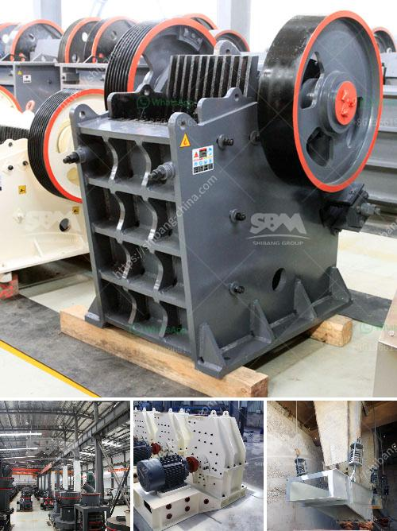

<h3>used screens crushers for coal uk</h3>
The coal industry has been a significant part of the UK's energy landscape for centuries. Coal is a valuable natural resource that has played a vital role in powering the nation's industries, heating homes, and generating electricity. As the industry evolved, so did the technology used to extract and process coal. One essential piece of equipment in coal mining operations is the screen crusher.

A screen crusher is a machine used to separate coal into various sizes for further processing. It consists of a vibrating screen or a trommel screen with a rotating cylindrical drum that allows coal to pass through various size openings. The coal that meets the desired size requirements falls through the screen, while oversized coal is sent to be crushed by the crusher part of the equipment.

Used screens crushers for coal in the UK are in high demand due to a few factors. Firstly, the coal industry has seen a resurgence in recent years as the country looks for alternative domestic energy sources. With coal reserves still available, the need for efficient and reliable screening and crushing equipment is paramount.

Secondly, used equipment offers a cost-effective solution for companies seeking to upgrade their coal processing plants without incurring significant capital investments. By purchasing a reliable used screens crusher, operators can improve their productivity and efficiency while reducing costs. The UK is home to various mining equipment suppliers offering a wide range of pre-owned screens crushers, ensuring companies can find the appropriate equipment to suit their specific needs and budget.

Moreover, the versatility of screens crushers allows companies to process different coal grades simultaneously, simplifying their operations. By using multiple screens with varying sizes, companies can sort coal into different categories, catering to specific customer demands. This flexibility gives UK coal producers a competitive edge both domestically and in global markets.

In recent years, environmental concerns have become increasingly important in all industries, including coal mining. One way the coal industry in the UK addresses these concerns is through the use of screens crushers. By separating coal into different sizes, operators can reduce the generation of coal fines. Coal fines are tiny particles that are difficult to handle and can create dust, posing significant health and environmental risks. A well-functioning screen crusher improves coal quality and reduces the amount of fines, making it more marketable and environmentally friendly.

The availability of used screens crushers for coal in the UK enables companies to adopt the latest technology without breaking the bank. Many pre-owned machines on the market are still relatively new, and buying used equipment from reputable suppliers ensures its quality and performance. Additionally, suppliers often offer after-sales support and spare parts, giving companies peace of mind knowing they can rely on their equipment in the long run.

In conclusion, used screens crushers for coal in the UK play a crucial role in the coal mining industry. They enable operators to efficiently separate coal into different sizes, improve the quality of the final product, and reduce environmental impact. With the resurgence of the coal industry and the availability of cost-effective used equipment, companies can upgrade their coal processing plants while remaining competitive in the market.
<h3>Contact us</h3><ul><li><strong>Whatsapp:&nbsp;<a href="https://wa.me/8613661969651">+8613661969651</a></strong></li><li><a href="https://swt.shibang-china.com/?git&amp;zhl&amp;used screens crushers for coal uk"><strong>Online Service(chat now)</strong></a></li></ul><h3>Related</h3><ul><li><a href='picture of silica sand process plant.md'>picture of silica sand process plant</a></li><li><a href='iron ore loading grinding process plant.md'>iron ore loading grinding process plant</a></li><li><a href='mica mill roller mill.md'>mica mill roller mill</a></li><li><a href='two roll mill supply in sri lanka.md'>two roll mill supply in sri lanka</a></li><li><a href='working hours of a crusher plant.md'>working hours of a crusher plant</a></li></ul>